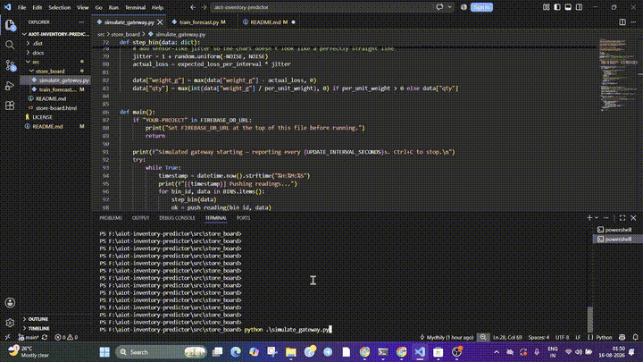
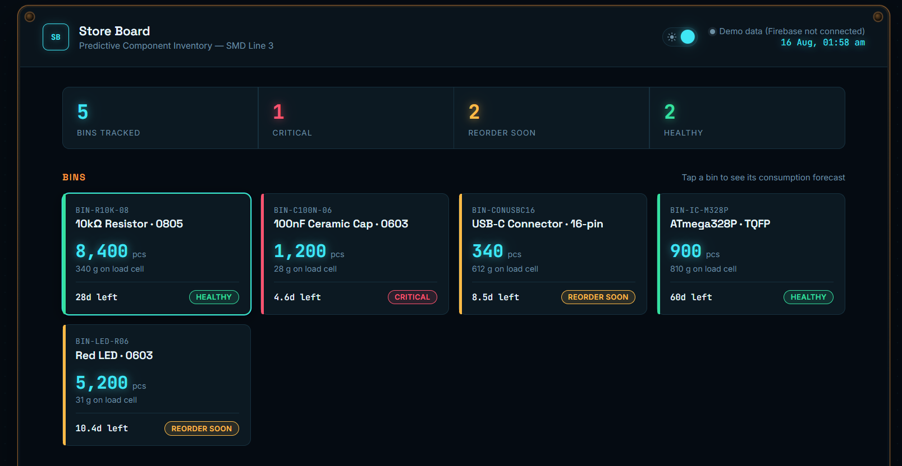

# AI-Based Predictive Inventory Management System (PIMS)

Manufacturing industries often face production delays due to inaccurate inventory monitoring, unexpected stock shortages, delayed procurement, and inefficient manual inventory management. Most existing inventory systems only notify users after stock levels become critically low, leaving insufficient time to procure replacement materials. 

**AIoT Inventory Predictor** is an edge-based IoT system using the **Analog Devices MAX32630FTHR** to monitor material consumption and predict potential stockouts before they disrupt manufacturing.

📷 **`DEMO`** 


**Full documentation:** [📅 Day -1: Planning](docs/day1-planning.md) · [🧩 Software Architecture & Code](docs/software-architecture.md) · [📅 Day 2: Installation & Setup Guide](docs/day2-setup.md)

---

## Overview

Most inventory systems only track *how much* stock exists. This project tracks four things instead:

1. **Identity** — is it the *right* component? (camera)
2. **Quantity** — how many are there, *really*? (load cell)
3. **Location** — is it in the *correct* bin? (RFID)
4. **Future need** — will there be *enough* for upcoming production? (AI forecast)

A microcontroller (MAX32630FTHR) reads all three sensors per bin, pushes the readings to a Firebase Realtime Database over Wi-Fi, and a Python backend on a laptop/server runs image analysis, quantity verification, and a regression-based depletion forecast. When a bin is predicted to run out before its reorder lead time, the system sends an email/WhatsApp alert automatically.

### Features

- Real-time weight-based quantity tracking (HX711 + load cell) pushed to the cloud every 30s
- Camera-based component identification to catch "right bin, wrong part" errors
- RFID-based bin/location verification
- Machine-learning depletion forecasting (rate of consumption → days until empty)
- Automatic reorder alerts via Email and WhatsApp (CallMeBot)
- Web-based GUI dashboard (HTML front end)
- Local OLED + buzzer + LED status indicators on the bin itself

---

## Documentation Chapters

| Chapter | What's in it |
|---|---|
| [📅 Day -1: Planning](docs/day1-planning.md) | Problem research & data collection, system architecture diagram, **circuit diagram & wiring table**, complete product photos, full bill of materials |
| [🧩 Software Architecture & Code](docs/software-architecture.md) | How `simulate_gateway.py`, `train_forecast.py`, and the GUI work — code, and the design reasoning behind the ML forecasting approach |
| [📅 Day 2: Installation & Setup Guide](docs/day2-setup.md) | Beginner-friendly, step-by-step: installing Python, Firebase setup, running the simulator and forecast script, reading the output, enabling Email/WhatsApp alerts |

---

## Results / Demo

- **Working:** simulated sensor data → Firebase → regression forecast → reorder alert (verified end-to-end with `BIN-C100N-06` correctly flagged at 2.9-day forecast vs. 5-day threshold).
- **Not yet on real hardware:**  Coming soon...


   *Sample Output*

## Future Improvements

- Wire and test real HX711 + load cells per bin (replace simulator with live hardware)
- Integrate the camera-based image classification model (currently only planned)
- Finish and screenshot the HTML GUI dashboard
- Add the AI chatbot for natural-language reorder queries
- Move from a single custom PCB prototype to a small enclosure per bin

---

## Repo Structure

```
aiot-inventory-predictor/
├── README.md                        ← you are here (overview + links)
├── docs/
│   ├── day1-planning.md             ← architecture, circuit diagram, BOM
│   ├── software-architecture.md     ← code + design notes
│   └── day2-setup.md                ← step-by-step setup guide
├── images/
│   ├── image1.png   ... image26.png
├── src/
│   └── store_board/
│       ├── simulate_gateway.py
│       └── train_forecast.py
└── gui/
    └── index.html
```
