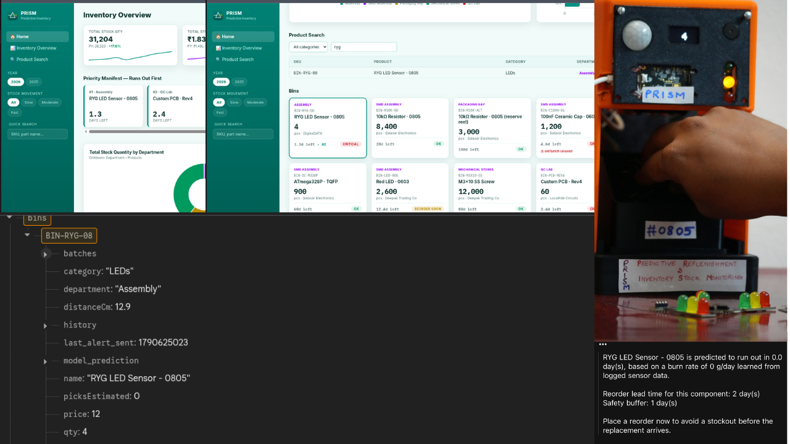
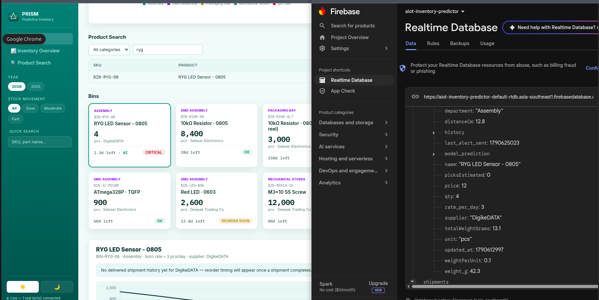
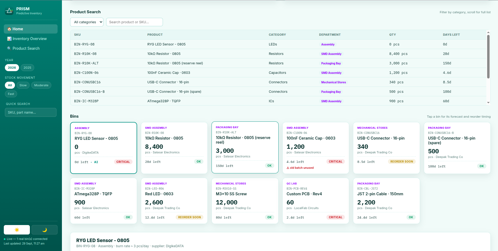
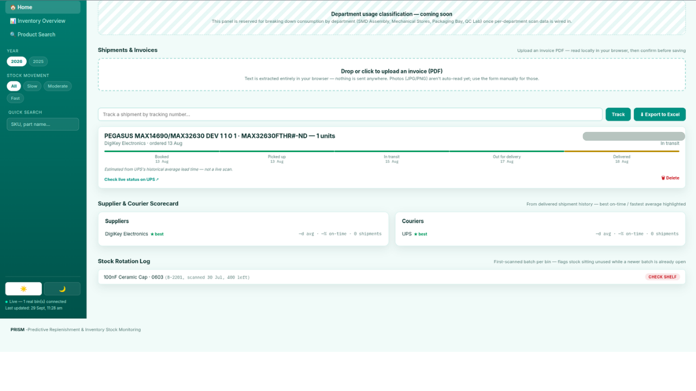

# PRISM — Predictive Replenishment & Inventory Stock Monitoring

**PRISM predicts what you're about to run out of, before you run out.**


📺 **Demo video:** [youtu.be/odlPvgT5Zeg](https://youtu.be/odlPvgT5Zeg?si=Ek_2I9EwPxp-R_3K)  
📖 **Full build write-up:** [PROJECT_DETAILS.md](https://github.com/mydhily-mr/aiot-inventory-predictor/blob/main/docs/PROJECT_DETAILS.md)  
📺 **Website:** [Website Link](https://mydhily-mr.github.io/prism/)  
🛠️ **Sensor testing docs:** [docs/](https://github.com/mydhily-mr/aiot-inventory-predictor/tree/main/docs)

---

## What is PRISM?

PRISM turns an ordinary component bin into a smart AIoT inventory node. A load cell under the bin counts components in real time on an Analog Devices **MAX32630FTHR**. An IR sensor and the weight drop together estimate each pick. A red/yellow/green LED, an OLED display and a buzzer show the stock level right at the shelf.

Readings flow through a **NodeMCU Wi-Fi gateway** into **Firebase**. A web dashboard gives the stock manager a live view, and a machine-learning model forecasts **days-to-empty** for every bin.

The aim is to know how much stock is left, and also when it is going to run out.

## Why build it?

- **Counts are stale.** Stock is counted by hand or updated at the end of a shift, so the record never matches the shelf.
- **Systems track issues, not what is left.** Barcode and ERP entries record what was booked out, not what is physically in the bin.
- **Stock-outs are found too late.** A bin is found empty after the time to reorder has passed.
- **Reorder points ignore real usage.** Fixed minimum levels don't follow actual consumption or supplier lead time.
- **Workers get no signal.** Nothing at the shelf warns that a bin is nearly empty.

## Key Features

- **Counts by weight:** no scan per pick, because the bin always knows its own count.
- **Sensor fusion for picks:** the IR sensor sees a hand enter, and the weight drop after the hand leaves shows how many pieces were taken.
- **Forecasts learned from data:** reorder timing comes from the measured depletion trend, not a fixed minimum level.
- **Alerts work offline:** the LED, OLED and buzzer run on the MAX32630FTHR itself, so the shelf still warns the worker if Wi-Fi drops.
- **One protocol for any bin:** each bin's identity lives on the device and the gateway is a generic relay, so adding a bin only needs a new `binId`.

## Who It Serves

| Who | What they get | Built with |
|---|---|---|
| Worker at the shelf | Live piece count, green / yellow / red stock light, and a 10-second buzzer at 20% stock | MAX32630FTHR, load cell, OLED, RYG LED, buzzer |
| Stock manager | Live dashboard with stock KPIs, bins ranked by which runs out first, per-bin forecast charts, reorder timing, shipments and FIFO checks | Firebase + web dashboard |
| Purchasing | Days-to-empty from each bin's consumption trend, plus an email alert when a bin drops inside its lead time | Python regression model |

## How It Works

```
Inventory → Sensors → MAX32630FTHR → NodeMCU Wi-Fi → Firebase → Dashboard → Prediction → Email Alert
```



### Stock Level Indication

Count estimate: **Number of pieces = (Measured Weight − Empty Tray Weight) / Weight of One Piece**
(demo: tray ≈ 55 g, one RYG LED ≈ 3.55 g)

| Light | Rule | Action |
|---|---|---|
| 🟢 Green | above 50% | Normal |
| 🟡 Yellow | 21% to 50% | Worker is alerted that stock is decreasing |
| 🔴 Red | 20% or less | Red LED + 10-second buzzer, so the worker notifies the store manager |

## Hardware

| Component | Qty |
|---|---|
| [MAX32630FTHR](https://www.analog.com/media/en/technical-documentation/data-sheets/max32630fthr.pdf) + MAX32625PICO (DAPLink) | 1 |
| Load Cell 5 kg + HX711 amplifier | 1 |
| SSD1306 OLED Display 0.96" | 1 |
| HC-SR04 Ultrasonic Sensor | 1 |
| IR Sensor | 1 |
| PIR Sensor | 1 |
| Piezo Buzzer | 1 |
| RYG LED indicator | 1 |
| RYG LEDs (demo inventory items) | 14 |
| NodeMCU (ESP Wi-Fi) | 1 |
| Zero / dotted PCB, jumper wires, 3D-printed enclosure | — |

🛒 Full BOM: [DigiKey MyList](https://www.digikey.in/en/mylists/list/48SZ6VB09U)

### Pin Connections (MAX32630FTHR)

| Module | Pins |
|---|---|
| HX711 | VCC → 3.3 V, GND → GND, DOUT → P5_5 (pin 45), SCK → P5_4 (pin 44) |
| ESP Wi-Fi | GND → GND, D7 (RX) → P3_1 (TX), D8 (TX) → P3_0 (RX) |
| SSD1306 OLED | VCC → 3V3, GND → GND, SDA → P3_4, SCL → P3_5 |
| HC-SR04 Ultrasonic | VCC → 3V3, GND → GND, TRIG → P5_6, ECHO → P4_0 |
| RYG LED | GND → GND, R → P5_0, Y → P5_1, G → P5_2 |
| Piezo Buzzer | VCC → 3V3, GND → GND, SIG → P5_3 |
| IR Sensor | VCC → 3V3, GND → GND, O/P → P3_3 |
| PIR Sensor | VCC → 3V3, GND → GND, OUT → P3_2 via 1K resistor to GND |

Load cell → HX711: Red → E+, Black → E−, Green → A+, White → A−


## Tech Stack

- **Firmware:** Arduino IDE with the Maxim MAX326xx board package (MAX32630FTHR, DAPLink programmer)
- **Gateway:** NodeMCU Wi-Fi module over UART
- **Cloud:** Firebase Realtime Database
- **Dashboard:** Web GUI with inventory overview, category filtering, per-bin forecasts, trend and history charts, invoice PDF tracking and night mode
- **AI:** Python Linear Regression model for days-to-empty forecasting, with email alerts
- **Enclosure:** Designed in Fusion 360 and 3D-printed

## Getting Started

1. **Set up the board.** In Arduino IDE, add this URL under *File → Preferences → Additional Boards Manager URLs*:
   ```
   https://raw.githubusercontent.com/analogdevicesinc/arduino-max326xx/master/package_maxim_index.json
   ```
   Install **Maxim's 32-bit Microcontroller** from the Boards Manager. Then select **MAX32630FTHR**, your port (e.g. `/dev/ttyACM0`) and the **DAPLink** programmer.
2. **Wire the sensors** using the pin table above.
3. **Test each sensor individually** by following the guides in [`docs/`](https://github.com/mydhily-mr/aiot-inventory-predictor/tree/main/docs).
4. **Flash the firmware**, calibrate the load cell (empty tray weight and single-piece weight), and connect the NodeMCU gateway to Firebase.
5. **Run the dashboard and prediction model** locally.

See [PROJECT_DETAILS.md](https://github.com/mydhily-mr/aiot-inventory-predictor/blob/main/docs/PROJECT_DETAILS.md) for the complete step-by-step build.

## Dashboard






## Project Status

PRISM is a working prototype. The GUI and prediction model currently run locally, and the RYG LED bin is the live real-time dataset. Next steps include more inventory categories, larger datasets, better prediction models and production-level deployment.

## Author

**Mydhily M R**. Built for the AIoT Design Challenge 2026.