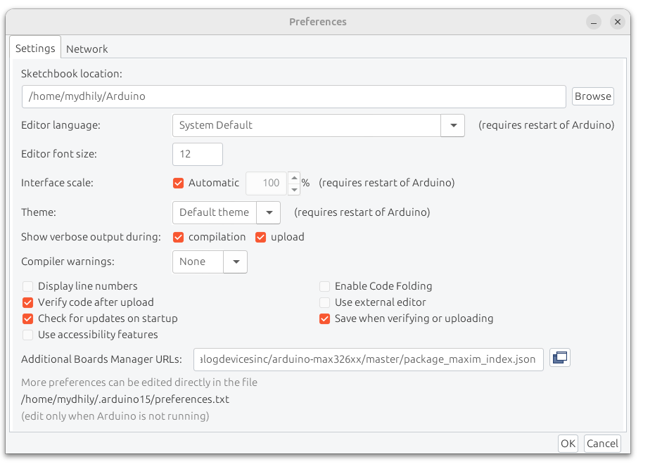
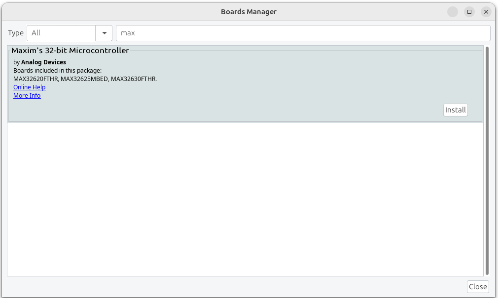
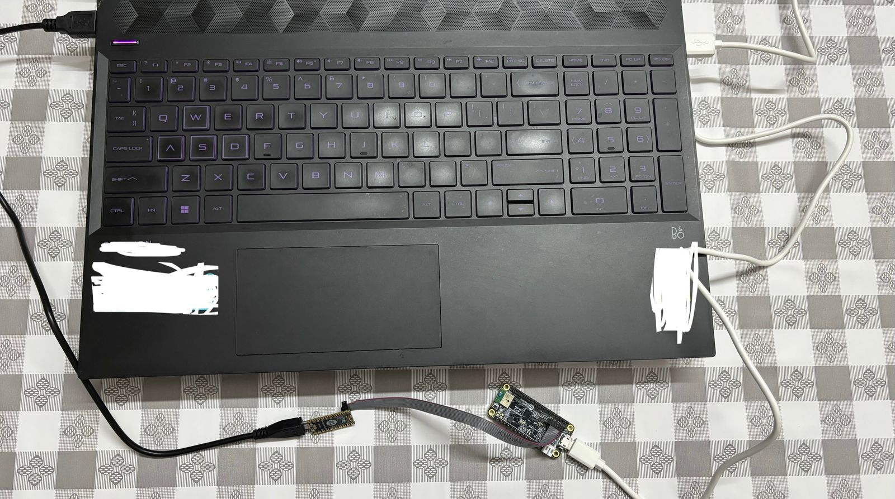
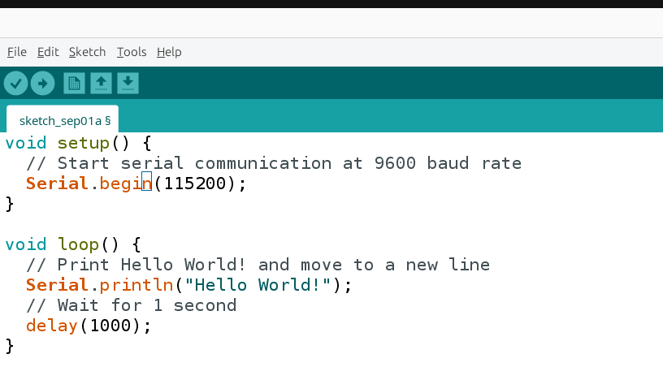
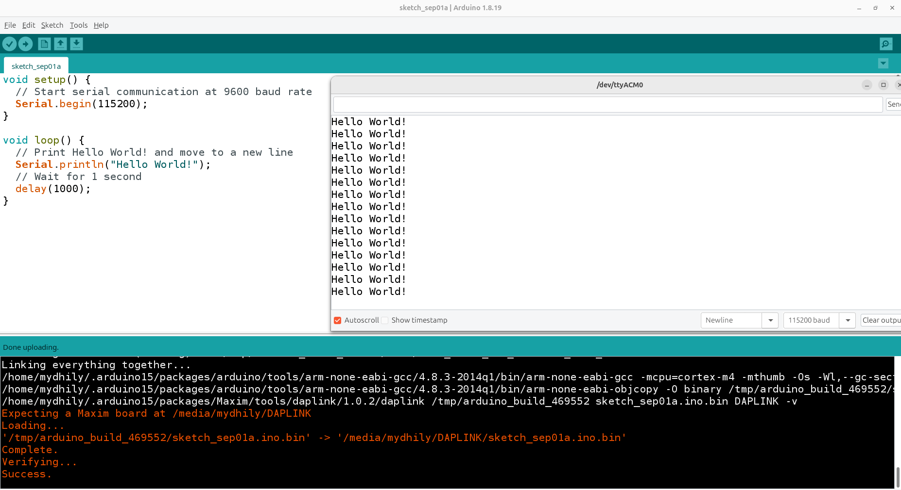

[← Back to README](../README.md)

## Day 2 - First Hello World on MAX32630FTHR board
<!-- **01/09/2026** -->


## Prerequisties
- Arduino IDE 1.18.9
- Ubuntu 20.04 LTS

### 1. Install MAX32630FTHR board on Ubuntu

- To install the MAX32630 (such as the MAX32630FTHR) board in the Arduino IDE, add Maxim's JSON package URL to your preferences and install the board via the Boards Manager.

- Add Maxim's JSON URL:
  ```bash
  https://raw.githubusercontent.com/analogdevicesinc/arduino-max326xx/master/package_maxim_index.json
  ```
  — Add Maxim's JSON URL in File --> Preferences and click OK.
  
  
- Then, open the Boards Manager via Tools > Board, search for maxim, and install Maxim's 32-bit Microcontroller

  — Click on Install and wait for the installation to be completed.

- After installation, select MAX32630FTHR under Tools > Board, choose your connected board's serial port in Tools > Port, and set the programmer to DAPLink under Tools > Programmer.

- Now connect the PICO and Board both to your PC.

  — Connect both MAX32625PICO and MAX32630FTHR board using USB cables provided.

- Now try the first program to test the board is OK or not, a simple hello world as shown in the example will be fine.

  — Click on Install and wait for the installation to be completed.
  
- Select Board as ```MAX32630FTHR ```, Port ``` /dev/ttyACM0 ```, Programmer ``` DAPLINK ``` , then open Serial Monitor, Select baud rate as ``` 115200 ```.

- Click on ``` Upload ``` to upload the program and observe the output in serial monitor.

  — If everything is fine you will see the success message after uploading and the output in serial monitor as in the given image.

  - If steps till above works, Congarts!!!! 
  Now you can start using MAX32630 board with other examples or sensors you are going to use.

  - Here i have provided test odes for each individual sensors i am using as a seperate chapter. Refer the same for details. 


---
[← Back: Software Architecture & Code](software-architecture.md) · [← Back to README](../README.md)
