**Name:** Mydhily M R

## Members (maximum 8 members):

| S. No. | Name | Role / Contribution | Contact (Optional) |
|---|---|---|---|
| 1. | Mydhily | Team lead: hardware, MAX32630FTHR firmware, NodeMCU gateway, Firebase, dashboard, AI forecasting |  - [-](mailto:-) [-](mailto:-) |

## Project Checklist

**Phase 1**

| Item | Status |
|---|---|
| Project Title | **Done** |
| Cover Image | **Done** |
| List of Components | **Done** |
| Detailed Project Description | **Done** |
| Schematics | **Done** |
| Code | **Done** |
| CAD/ PCB Design If any *Optional | **Done** |
| Photo of project | **Done** |
| Video displaying working of Project | **Done** |
| BONUS/OPTIONAL: Video explaining working of the project | **Done** |

# Title: PRISM — Predictive Replenishment & Inventory Stock Monitoring

**Tag line:** **PRISM predicts what you're about to run out of, before you run out.**

## Cover Image:

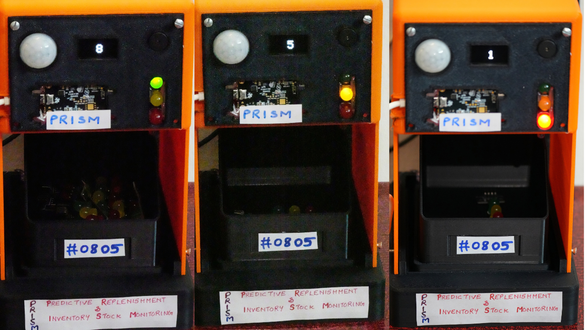

## Video:

**[https://youtu.be/odlPvgT5Zeg?si=Ek_2I9EwPxp-R_3K](https://youtu.be/odlPvgT5Zeg?si=Ek_2I9EwPxp-R_3K)**

## Component List:

DigiKey MyList (BOM): **[MyList link Click here](https://www.digikey.in/en/mylists/list/48SZ6VB09U)**

| Sl No | Name | Qty | Datasheet | Link |
|---|---|---|---|---|
| 1 | MAX32630 FTHR | 1 | [Datasheet Link](https://www.analog.com/media/en/technical-documentation/data-sheets/max32630fthr.pdf) | [Link to Buy](https://www.digikey.in/en/products/detail/analog-devices-inc-maxim-integrated/MAX32630FTHR/6575544) |
| 2 | Load Cell 5 Kg | 1 | [Datasheet Link](https://cdn.sparkfun.com/assets/e/5/f/5/6/TAL220B.pdf) | [Link to Buy](https://www.digikey.in/en/products/detail/sparkfun-electronics/14729/9555603) |
| 3 | HX711 BOARD | 1 | [Datasheet Link](https://mm.digikey.com/Volume0/opasdata/d220001/medias/docus/5858/333005%20Load%20cell%20amplifier%20HX711%20board%20datasheet.pdf) | [Link to Buy](https://www.digikey.in/en/products/detail/soldered-electronics/333005/21720457) |
| 4 | SSD1306 OLED Display 0.96" | 1 | Datasheet Link | Link to Buy |
| 5 | Ultrasonic Sensor | 1 | [Datasheet Link](https://www.digikey.in/en/products/detail/adafruit-industries-llc/3942/9658069) | [Link to Buy](https://mm.digikey.com/Volume0/opasdata/d220001/medias/docus/692/3942_Web.pdf) |
| 6 | Piezo Buzzer | 1 | Datasheet Link | Link to Buy |
| 7 | PIR Sensor | 1 | [Datasheet Link](https://mm.digikey.com/Volume0/opasdata/d220001/medias/docus/8924/ST0012%20%20%20HC-SR501%20Human%20Body%20Pyroelectricity%20Infrared%20Sensor%20Module.pdf) | [Link to Buy](https://www.digikey.in/en/products/detail/sunfounder/ST0012/22116811) |
| 8 | IR Sensor | 1 | Datasheet Link | Link to Buy |
| 9 | Dotted PCB | 1 | Datasheet Link | Link to Buy |
| 10 | Bread Board | 1 | [Datasheet Link](https://mm.digikey.com/Volume0/opasdata/d220001/medias/docus/2329/239_Web.pdf) | [Link to Buy](https://www.digikey.in/en/products/detail/adafruit-industries-llc/239/7244929) |
| 11 | Jumper Wires | | [Datasheet Link](https://mm.digikey.com/Volume0/opasdata/d220001/medias/docus/8913/100862.pdf) | [Link to Buy](https://www.digikey.in/en/products/detail/soldered-electronics/555033/29271434) |
| 12 | Glue Gun | 1 | Datasheet Link | Link to Buy |
| 13 | Soldering ion | 1 | Datasheet Link | Link to Buy |
| 14 | RYG LED | 14 | | |

[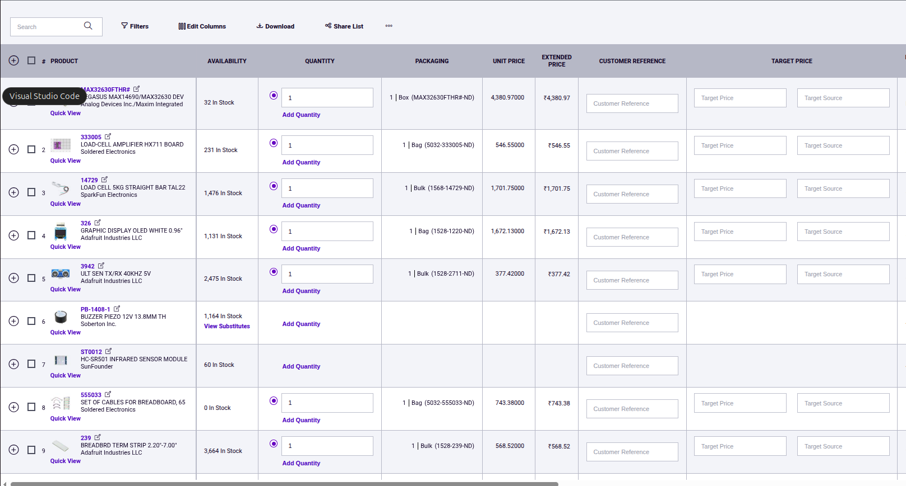](https://www.digikey.in/en/mylists/list/48SZ6VB09U)

**Click on Any Product** To Open List

---

## Project Explanation Step By Step :

### Introduction

In a busy electronics lab or production floor, a small component bin can look fine until someone reaches for it and finds it empty. By then, the shortage has already become a problem.

**PRISM** turns an ordinary component bin into a smart inventory system that keeps track of what is actually inside it.The idea is simple: instead of waiting for a bin to become empty, PRISM tries to tell you that it is going to happen before it does.

PRISM is the result of that idea — **not just knowing how much stock is left, but knowing when we need to start worrying about what comes next.**

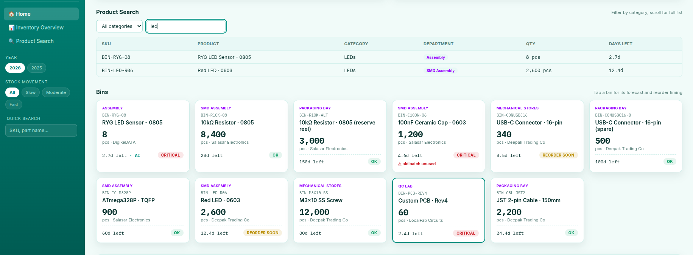

### Inspiration - What leads to PRISM?

 

I have faced this problem myself several times — needing a component for a project or a task, only to find out that the bin was empty or the required quantity wasn't available.

But when I started talking to colleagues working in different manufacturing and production environments, I realized this problem was much bigger than I had experienced.

I heard stories of production lines being stopped for an entire day because just **one small component was out of stock**. People would come to work, sit idle, and wait because the missing part hadn't been identified or replenished in time.

What surprised me was that this wasn't limited to electronics. Similar frustrations were being experienced by colleagues working in **mechanical, automotive, electronics, and other manufacturing industries**.

The problem wasn't always a lack of inventory management. The real problem was knowing **what is physically available right now — and when it is going to run out**.

That made me think:

**Why wait until a component is unavailable before we know there is a shortage?**

I wanted to build something that could continuously watch the physical stock, detect when components were being consumed, and warn us before a small shortage turns into a production stoppage.

That idea became **PRISM.**

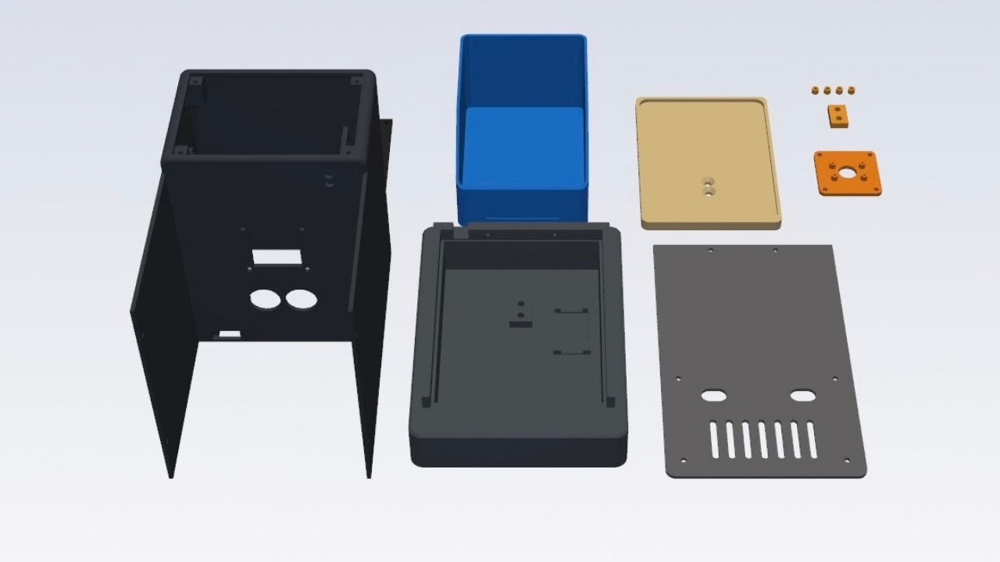

### The Problem Statement

- **Counts are stale:** Stock is counted by hand or updated in a spreadsheet at the end of a shift, so the record never matches the shelf.
- **Systems track issues**, not what is left. Barcode and ERP entries record what was booked out, not what is physically in the bin.
- **Stock-outs are found too late**. A bin is discovered empty at the shelf, after the time to reorder has already passed.
- **Reorder points ignore real usage**. Fixed minimum levels do not follow the actual consumption rate or the supplier's real lead time.
- **Workers get no signal**. Nothing at the shelf tells the person picking parts that the bin is nearly empty.

### Existing Systems

**FIFO**

The components received first are used first. This helps prevent old or perishable components from remaining in inventory for too long.

**Kanban System**

Uses visual signals, such as cards or digital alerts, to indicate when components need to be replenished. It helps maintain the required stock level and avoid shortages.

**Lean Manufacturing**

Focuses on reducing waste, excess inventory, and unnecessary processes. The goal is to keep only the inventory needed for production.

**Six sigma**

Uses data and statistical methods to reduce errors and variations in processes. In inventory management, it can help improve demand forecasting and reduce inventory-related mistakes.

**Bulk Manufacturing**

Produces large quantities of products or components at once. This can reduce production costs but may lead to excess inventory if demand is not accurately predicted.

## The PRISM-Overview

### What Makes PRISM Different?

Instead of relying on manual stock checks or simply recording what components were issued, PRISM monitors the physical stock inside the bin itself. A load cell continuously measures the weight of the contents and estimates the number of components remaining, while an IR sensor helps identify when parts are picked. Local LEDs, an OLED display, and a buzzer provide immediate feedback to the person working at the shelf.

But PRISM doesn't stop at knowing what is available right now.

The bin sends its readings through a Wi-Fi gateway to Firebase, where the inventory can be monitored through a web dashboard. The system tracks the consumption trend and uses it to estimate how many days are left before the stock runs out.

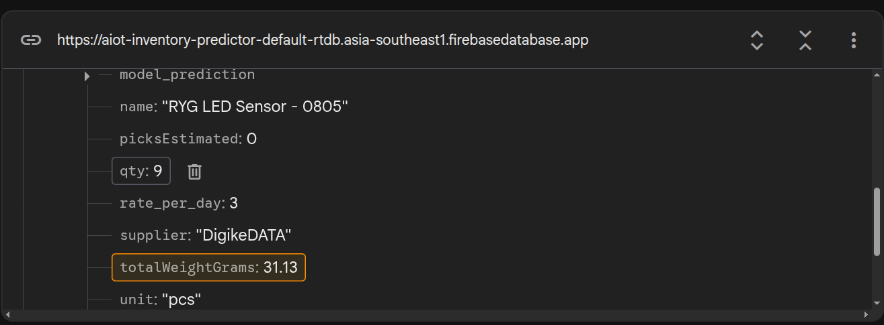

This means the system can move from simply saying "this bin is low" to giving the team an early warning that "this bin is going to run out soon."

The goal is simple: instead of discovering a shortage when someone needs the last component, PRISM gives workers, stock managers, and purchasing teams time to react before that shortage becomes a production problem.

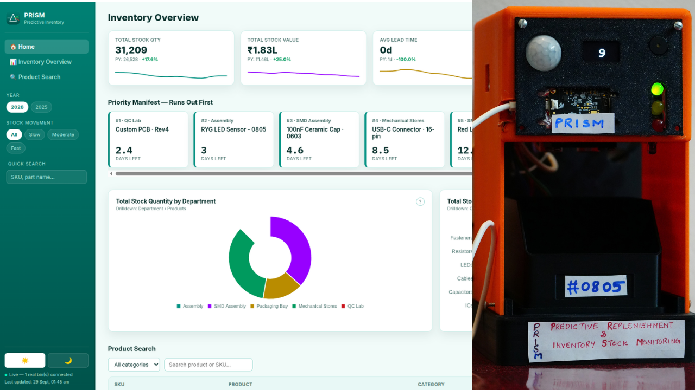

### What PRISM does

PRISM serves three people from one bin:

| **Who** | **What they get** | **Built with** |
|---|---|---|
| Worker at the shelf | Live piece count with a + / − change marker, a green / yellow / red stock light, and a 10-second buzzer when stock falls to 20% | MAX32630FTHR, load cell, OLED, RYG LED, buzzer |
| Stock manager | A live dashboard: stock KPIs, bins ranked by which runs out first, forecast chart per bin, reorder timing against supplier lead time, shipments and FIFO checks | Firebase + web dashboard |
| Purchasing | Days-to-empty learned from each bin's consumption trend, plus an email / WhatsApp alert when a bin drops inside its lead time | Python regression model |

### What makes it different

**Counts by weight.** No scan per pick: the bin knows its own count at all times.

**Sensor fusion for picks**. The IR sensor sees a hand enter; the weight drop after the hand leaves says how many pieces were taken.

**Forecasts learned from data.** Reorder timing comes from the measured depletion trend, not a fixed minimum level.

**Alerts work offline**. The LED, OLED and buzzer run on the MAX32630FTHR itself, so the shelf still warns the worker if Wi-Fi drops.

**One protocol for any bin.** Each bin's identity lives on the device; the gateway is a generic relay, so a new bin needs only a new `binId` .

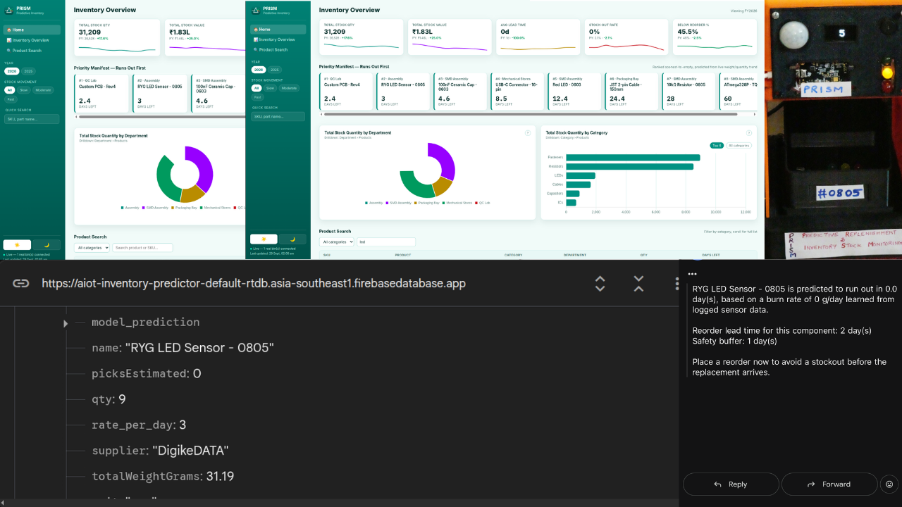

### How PRISM Works: Complete Flow

A load cell under the bin counts components in real time on an Analog Devices MAX32630FTHR, an IR sensor and the weight drop together estimate each pick, and a red/yellow/green LED, OLED and buzzer tell the worker the stock level right at the shelf. Readings flow through a NodeMCU Wi-Fi gateway into Firebase, where a web dashboard gives the stock manager a live view and a machine-learning model forecasts days-to-empty for every bin.

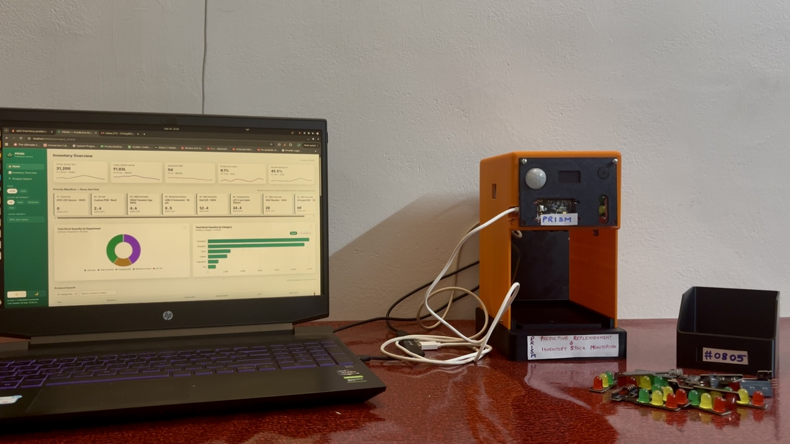

### Why did I build this?

This project started with a simple question: **why do we only realize that a component bin is empty when we actually need something from it?**

In an electronics lab, storeroom, or production floor, hundreds of small components can sit quietly in storage bins. The problem is that the stock inside those bins keeps changing, while the inventory record often doesn't. Someone takes a few components, another person takes a few more, and eventually the bin is empty — usually when someone needs that exact part.

I wanted to build something that could actually keep an eye on the bin.

PRISM turns an ordinary component storage bin into a smart inventory node. It uses weight sensing to estimate how many components are left, detects when parts are picked, and gives an immediate indication of the stock level using an RGB LED, OLED display and buzzer. The data is also sent to the cloud so the inventory can be monitored remotely.

But I didn't want PRISM to simply tell me "the bin is almost empty." I wanted it to answer a more useful question:

**"When is this bin going to become empty?"**

That's where the prediction part comes in. PRISM analyses the consumption trend and **estimates the number of days remaining before the stock runs out,** giving enough time to plan a reorder instead of discovering the shortage at the last moment.

This project has been a journey of sensors, wiring, calibration, firmware, debugging, failed experiments, and plenty of moments where something worked perfectly one minute and completely refused to work the next.

It is not a polished commercial product. It is a real working prototype that I built to explore how embedded systems, IoT, cloud monitoring and machine learning can come together to solve a very ordinary but very real problem.

So, this is the story of PRISM — a bin that doesn't just store components, but keeps track of them and tries to warn you before they run out.

Let's dive into how PRISM was built.

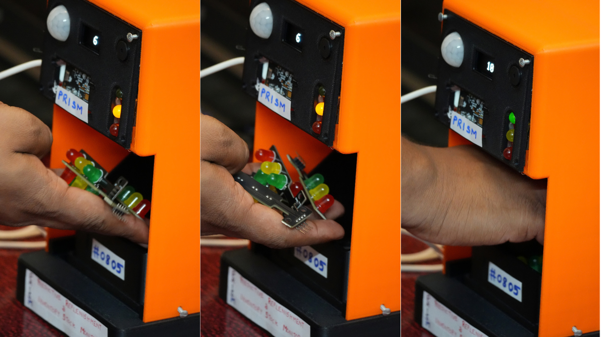

### Components Required

DigiKey MyList (BOM): **[MyList link Click here](https://www.digikey.in/en/mylists/list/48SZ6VB09U)**

| Sl No | Name | Qty | Datasheet | Link |
|---|---|---|---|---|
| 1 | MAX32630 FTHR | 1 | [Datasheet Link](https://www.analog.com/media/en/technical-documentation/data-sheets/max32630fthr.pdf) | [Link to Buy](https://www.digikey.in/en/products/detail/analog-devices-inc-maxim-integrated/MAX32630FTHR/6575544) |
| 2 | Load Cell 5 Kg | 1 | [Datasheet Link](https://cdn.sparkfun.com/assets/e/5/f/5/6/TAL220B.pdf) | [Link to Buy](https://www.digikey.in/en/products/detail/sparkfun-electronics/14729/9555603) |
| 3 | HX711 BOARD | 1 | [Datasheet Link](https://mm.digikey.com/Volume0/opasdata/d220001/medias/docus/5858/333005%20Load%20cell%20amplifier%20HX711%20board%20datasheet.pdf) | [Link to Buy](https://www.digikey.in/en/products/detail/soldered-electronics/333005/21720457) |
| 4 | SSD1306 OLED Display 0.96" | 1 | Datasheet Link | Link to Buy |
| 5 | Ultrasonic Sensor | | [Datasheet Link](https://www.digikey.in/en/products/detail/adafruit-industries-llc/3942/9658069) | [Link to Buy](https://mm.digikey.com/Volume0/opasdata/d220001/medias/docus/692/3942_Web.pdf) |
| 6 | Piezo Buzzer | | Datasheet Link | Link to Buy |
| 7 | PIR Sensor | | [Datasheet Link](https://mm.digikey.com/Volume0/opasdata/d220001/medias/docus/8924/ST0012%20%20%20HC-SR501%20Human%20Body%20Pyroelectricity%20Infrared%20Sensor%20Module.pdf) | [Link to Buy](https://www.digikey.in/en/products/detail/sunfounder/ST0012/22116811) |
| 8 | IR Sensor | | Datasheet Link | Link to Buy |
| 9 | Dotted PCB | | Datasheet Link | Link to Buy |
| 10 | Bread Board | | [Datasheet Link](https://mm.digikey.com/Volume0/opasdata/d220001/medias/docus/2329/239_Web.pdf) | [Link to Buy](https://www.digikey.in/en/products/detail/adafruit-industries-llc/239/7244929) |
| 11 | Jumper Wires | | [Datasheet Link](https://mm.digikey.com/Volume0/opasdata/d220001/medias/docus/8913/100862.pdf) | [Link to Buy](https://www.digikey.in/en/products/detail/soldered-electronics/555033/29271434) |
| 12 | Glue Gun | | Datasheet Link | Link to Buy |
| 13 | Soldering ion | | Datasheet Link | Link to Buy |

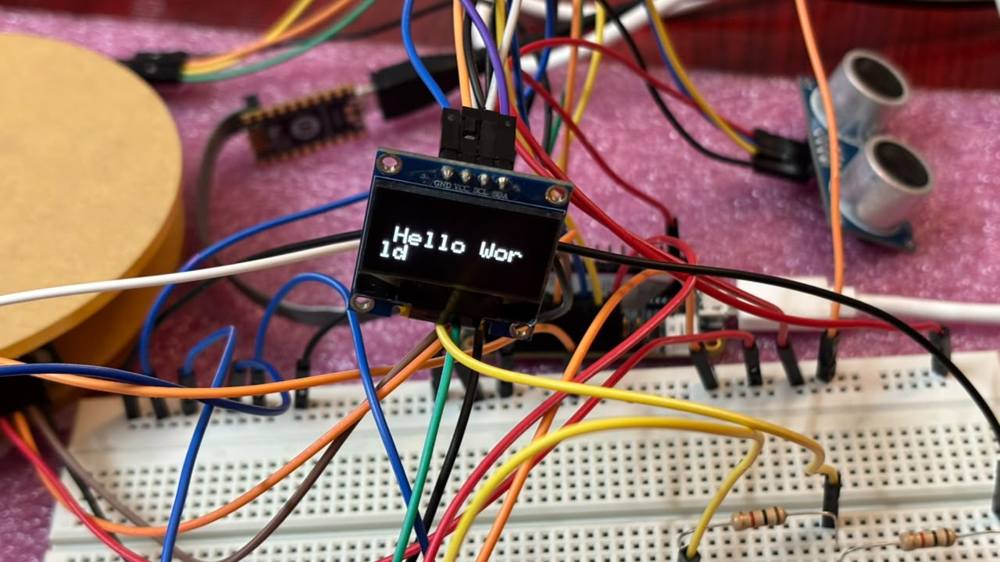

## Step 1: MAX32630 FTHR Board Set up

The development board and programming cable are provided separately. The initial board setup and programming steps were completed by following the official DAPLink documentation.

Reference: [https://daplink.io/](https://daplink.io/)

**Connections:**

Ribbon cable orientation — the cable has a colored stripe on one edge (marking pin 1).

It looks seated straight into both headers, but it's worth double-checking that the stripe lines up with the pin-1 marking (usually a small triangle, dot, or square pad) on both the PICO's connector and the target's header.

A cable seated backward or offset by one pin is a classic cause of exactly this "board not found" symptom, since the boards will still power up fine but SWD communication will fail.

Give the MCU board its own power The MAX32625PICO cannot supply power to every target board through the debug header alone. If your MCU is only powered through the PICO connection (rather than its own USB/power cable), connect a separate powered USB cable directly to the MCU board as well, so both boards are independently powered during programming.

**On Windows11 PC:**

Download the firmware file.

While holding down the boards reset button, connect the boards USB debug port to the computer. It should enumerate and mount as BOOTLOADER or MAINTENANCE. For boards that enumerate as BOOTLOADER see our blog to determine if an update for the DAPLink bootloader is available.

Drag-and-drop the firmware file onto the mounted drive. Wait for the file copy operation to complete.

Power cycle the board - Disconnect the USB cable from the board to remove power, then reconnect it normally without holding any buttons.

It will now enumerate and mount as DAPLIN or the name of the board.

Windows has removed the wmic command, and the older Maxim daplink tool, so try the below method:

**Export the compiled binary**

In Arduino IDE, go to Sketch → Export Compiled Binary. This saves the .bin file into your sketch's own folder permanently, instead of a temp folder that gets wiped — open the sketch folder afterward (Sketch → Show Sketch Folder) and you'll see it there.

**Open the DAPLINK drive**

Open File Explorer and confirm the DAPLINK drive is mounted (it should show a drive letter next to the label DAPLINK, alongside DETAILS.TXT).

**Copy the .bin file onto the DAPLINK drive**

Simply drag the exported .bin file from your sketch folder and drop it onto the DAPLINK drive, just like copying a file to a USB stick. The drive will briefly disappear and remount as it flashes the firmware.

**Check for success**

If something went wrong, a FAIL.TXT file will appear on the drive explaining why. If it succeeds, the board will reset and your Blink sketch should start running — with Auto Reset enabled on your board, this happens automatically.

**Note:**

Even though I flashed the board using Windows 11 PC, later I switched to Ubuntu 20.04 LTS, because driver support was limited in Windows.

## Step 2: MAX32630 FTHR Board Installation in Arduino IDE

MAX32630 board Pin Diagram

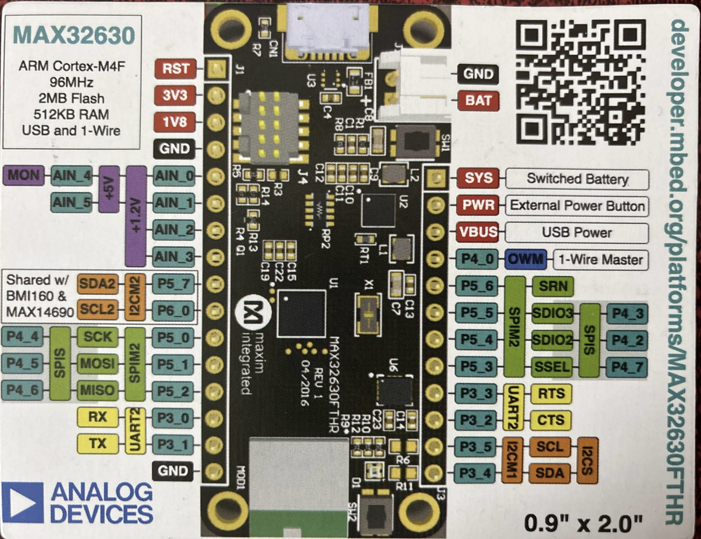

**1. Install MAX32630FTHR board on Ubuntu**

To install the MAX32630 (such as the MAX32630FTHR) board in the Arduino IDE, add Maxim's JSON package URL to your preferences and install the board via the Boards Manager.

Add Maxim's JSON URL:

[https://raw.githubusercontent.com/analogdevicesinc/arduino-max326xx/master/package_maxim_index.json](https://raw.githubusercontent.com/analogdevicesinc/arduino-max326xx/master/package_maxim_index.json)

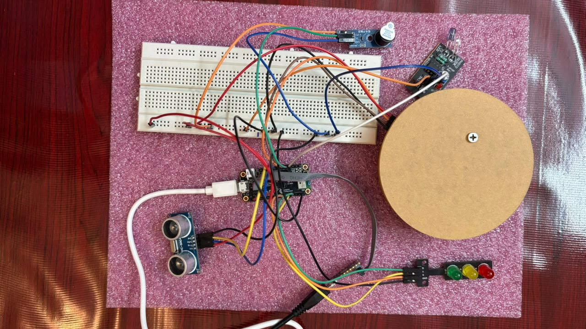

Add Maxim's JSON URL in **File --> Preferences** and click **OK**.

Then, open the Boards Manager via **Tools > Board**, search for maxim, and install Maxim's 32-bit Microcontroller

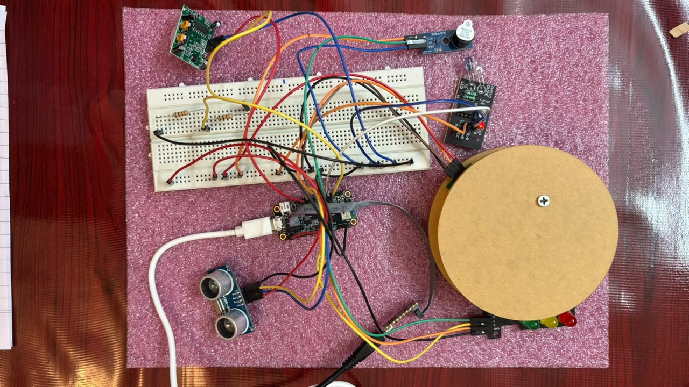

After installation, select MAX32630FTHR under Tools > Board, choose your connected board's serial port in Tools > Port, and set the programmer to DAPLink under Tools > Programmer.

Now connect the PICO and Board both to your PC.

Now try the first program to test the board is OK or not, a simple hello world as shown in the example will be fine.

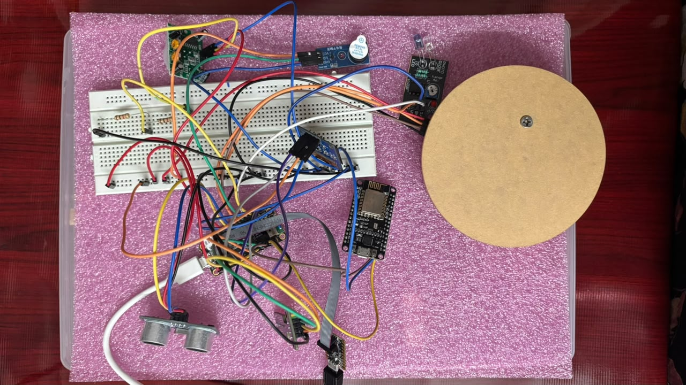

Select Board as MAX32630FTHR , Port /dev/ttyACM0, Programmer DAPLINK , then open Serial Monitor, Select baud rate as 115200.

Click on Upload to upload the program and observe the output in the serial monitor.

If the steps till above work, Congarts!!!! Now you can start using the MAX32630 board with other examples or sensors you are going to use.

## Step 3: Individual Sensor Testing

After installing the MAX32630 and successfully running the Hello World example, I moved on to testing each sensor individually before starting the complete system integration. The detailed testing procedures, schematics, and pin connections for each sensor are documented on my GitHub page and can be referred to for reproducing the setup.

**Github repo:** **[https://github.com/mydhily-mr/aiot-inventory-predictor/tree/main/docs](https://github.com/mydhily-mr/aiot-inventory-predictor/tree/main/docs)**

Individual sensor testing became the single most time-consuming phase of the project and had a major impact on the overall project timeline. Nearly half of my total project time was consumed by getting the individual sensors to work reliably. What I initially expected to be a relatively short validation stage turned into an extended debugging process, with different hardware and software issues appearing with different peripherals.

For example, In Wi-Fi communication, I used UART and encountered clock-related and power related issues when working with different baud rates. The OLED display introduced another major challenge because of compatibility issues in the Wire library. I had to investigate the Wire driver, identify the issue, and modify the library to get the OLED working correctly with my setup. Since the issue appeared to be related to the MAX32630 Arduino environment, I also attempted to contribute my fix to the official MAX32630 Arduino repository.

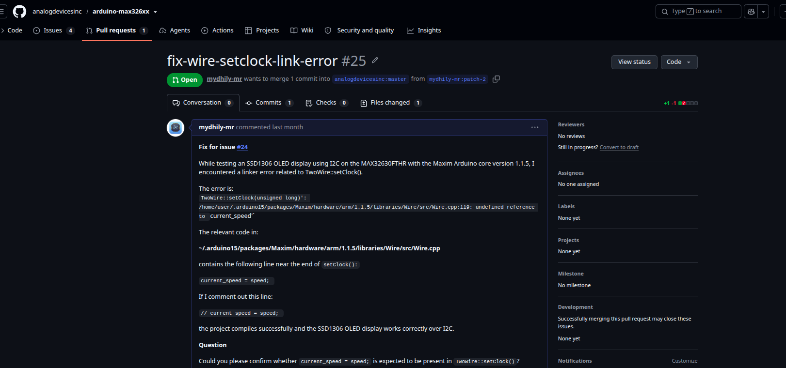

Although I am not completely certain that my modification is the correct or final solution for all configurations, it resolved the issue in my setup, and I submitted the changes to the official repository so that the issue and potential fix could be reviewed by the maintainers. I also documented the issue and my changes on the relevant official project page.

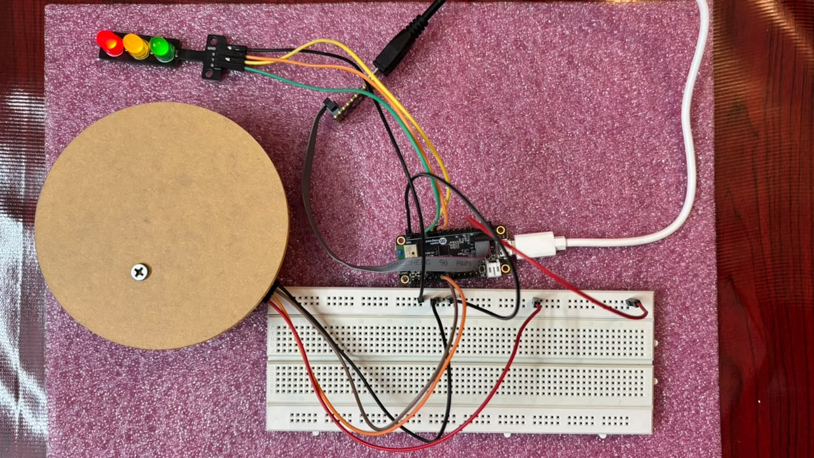

This debugging phase significantly reduced the time available for the remaining stages of the project. Tasks that were originally planned for system integration and higher-level functionality had to be pushed later because the individual components first had to be made stable. In practical terms, almost half of the project schedule was spent not on building the final system, but on making the individual sensors and their supporting libraries work correctly with the MAX32630.

Despite this setback, I eventually got all the individual sensors working successfully. More importantly, the process gave me a much better understanding of the MAX32630 platform, its peripheral interfaces, clock configuration, and the challenges involved in adapting existing Arduino libraries to a new hardware platform. Once the individual components were validated, I could proceed with system integration on a much more stable foundation.

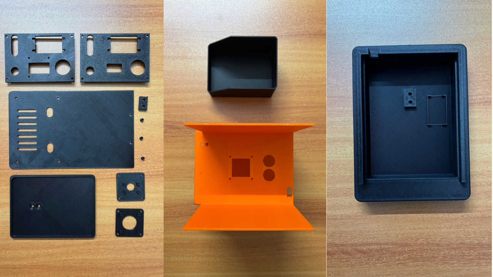

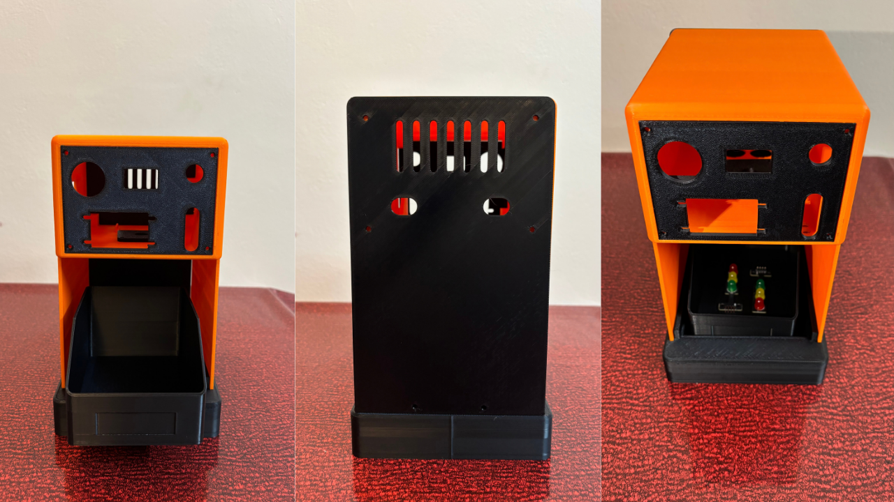

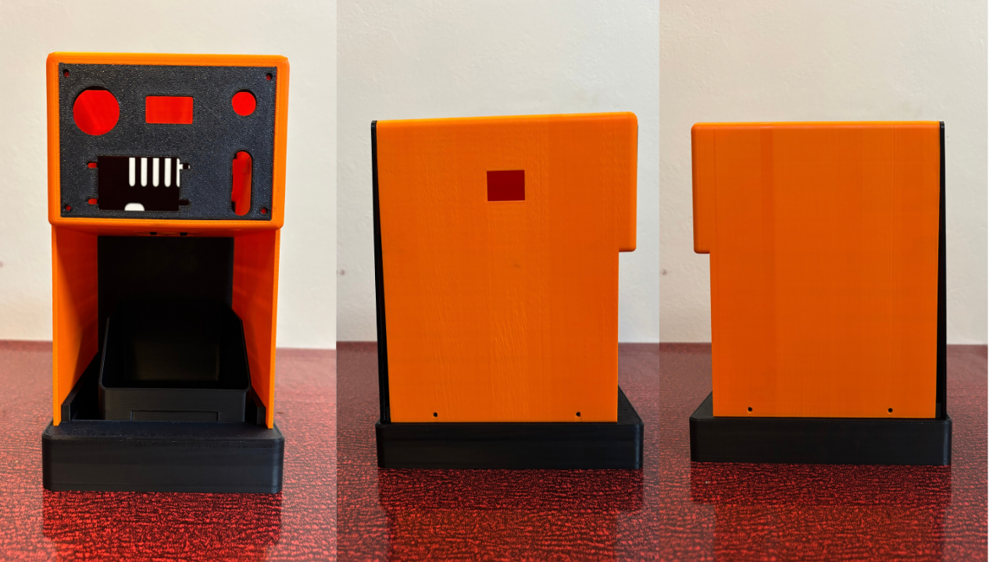

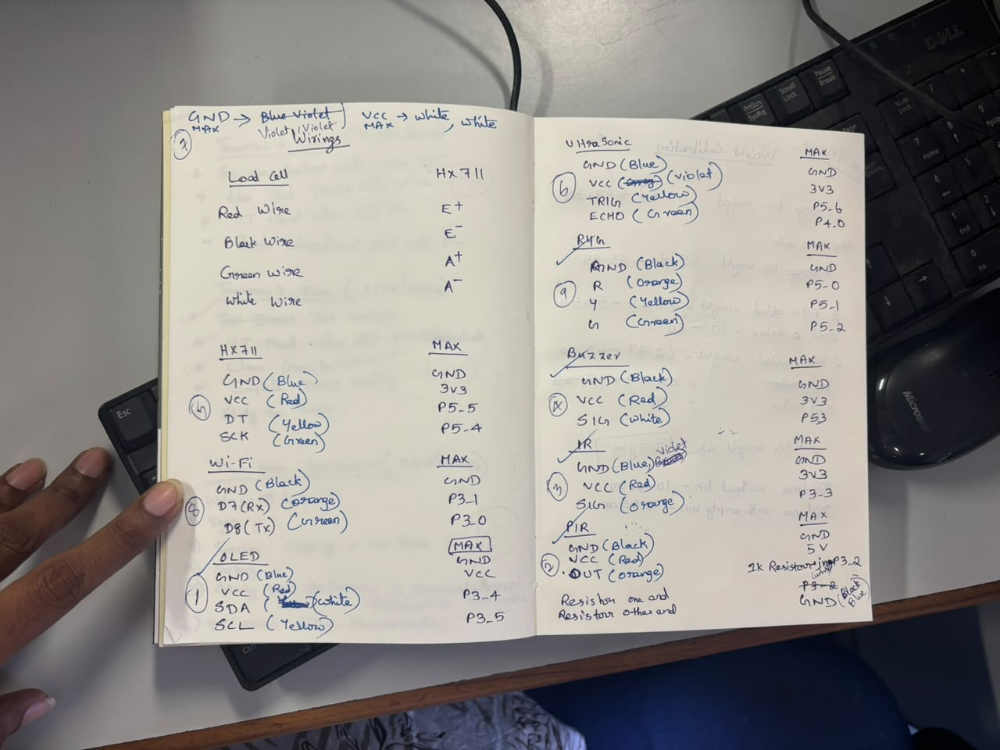

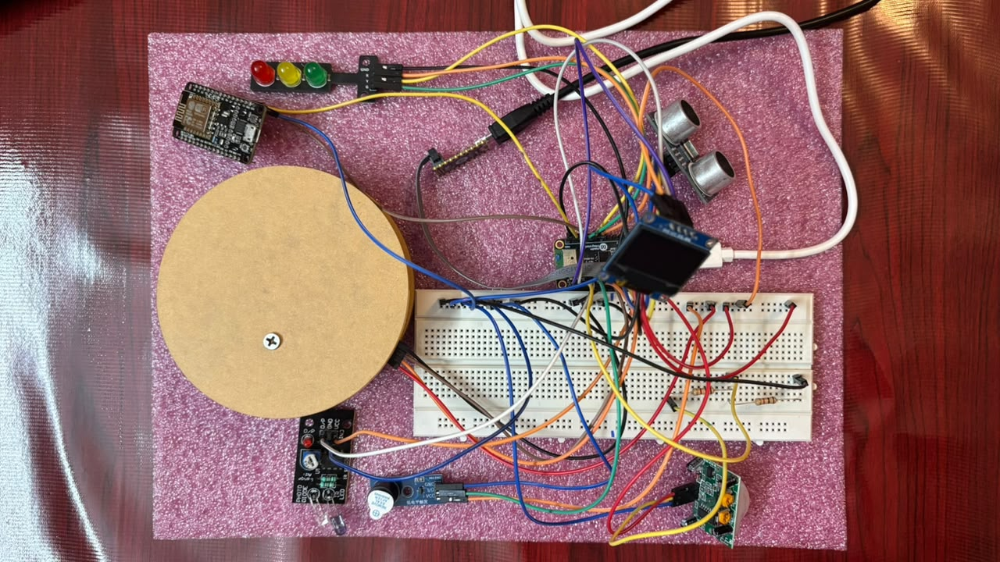

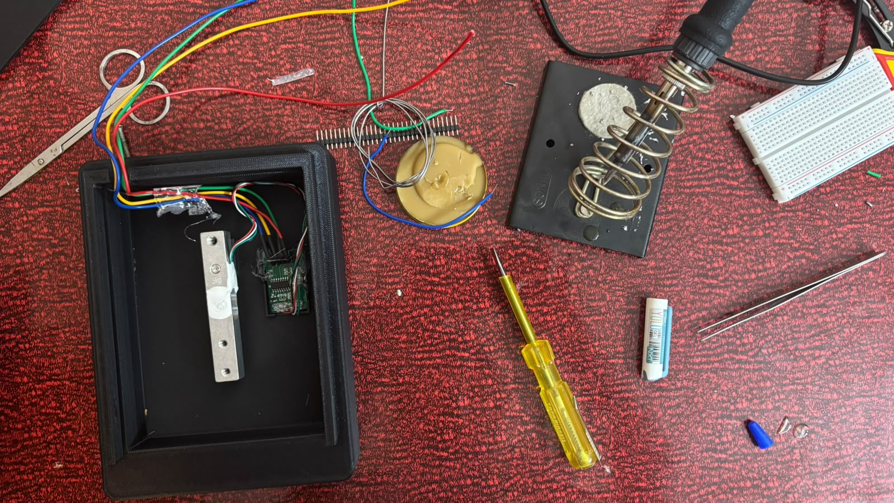

**Note: Individual Sensor Testing**

The detailed procedures and results for individual sensor testing are documented in the project's GitHub repository under the Documentation (docs) section. I have not reproduced the complete testing procedures here to avoid duplicating the documentation.

The GitHub documentation includes the required setup, wiring details, testing procedure, and verification steps for each sensor. Anyone who wants to reproduce or verify the individual sensor tests can refer to the documentation and follow the steps provided there.

**GitHub Documentation**: [https://github.com/mydhily-mr/aiot-inventory-predictor/tree/main/docs](https://github.com/mydhily-mr/aiot-inventory-predictor/tree/main/docs)

## Step 4: Design the Enclosure in Fusion 360

Once the individual sensor testing was completed and the components were working reliably, I moved on to the hardware design phase. At this point, I had only about two weeks remaining, so completing both the PCB design and the 3D-printed enclosure within the available time was a significant challenge, especially since I did not have much experience with either PCB design or CAD-based mechanical design.

Because of this limited timeline, I made a deliberate decision to use a zero-PCB approach for the prototype. Instead of spending the remaining time designing, fabricating, and debugging a custom PCB, I kept the tested modules and sensors as separate components and focused on getting them mechanically integrated into the prototype. This allowed me to prioritize the core functionality of the system and use the remaining time for CAD design, assembly, and system integration.

The CAD design itself required several iterations. Inventory management systems are generally deployed at a much larger scale in industrial environments, so I wanted the prototype to demonstrate the same underlying concept while keeping the physical implementation small enough for a practical demonstration.

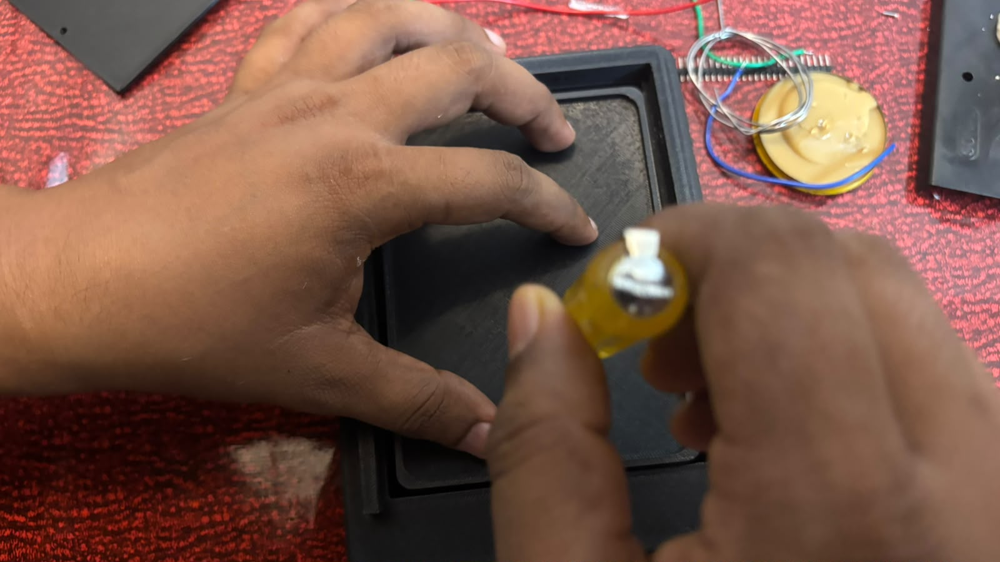

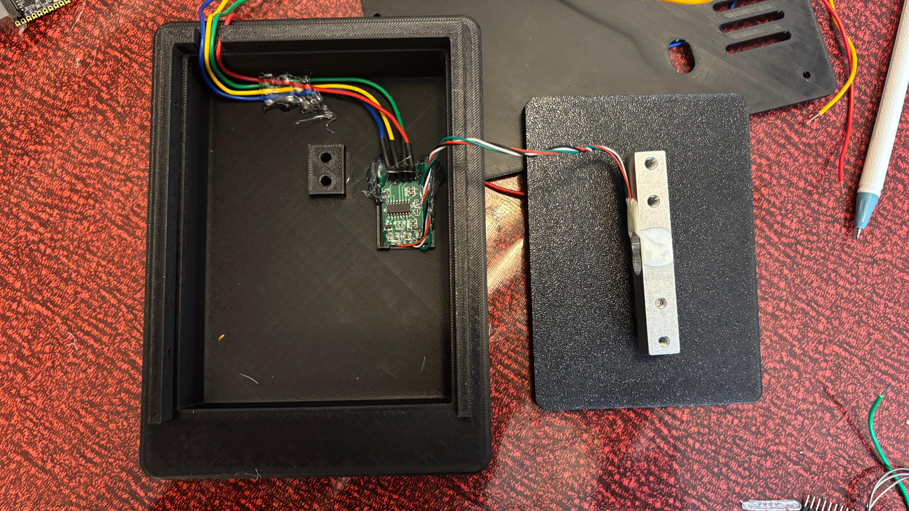

In a typical production environment, every component would move through a defined production or conveyor line, with the inventory management system positioned along this flow. Based on this concept, I decided to place my system at the entry and exit points of the production line, so that every item would pass through the system for detection and inventory tracking, similar in concept to how passengers pass through a scanner at a metro station.

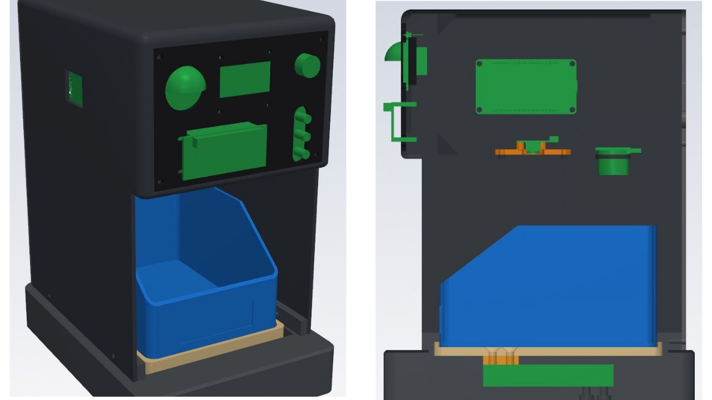

For the prototype, I scaled this concept down to a single compact system with a storage bin that fits within the enclosure. This allowed me to demonstrate the core inventory management workflow on a smaller scale while retaining the basic concept of how the system could be expanded for a larger industrial setup.

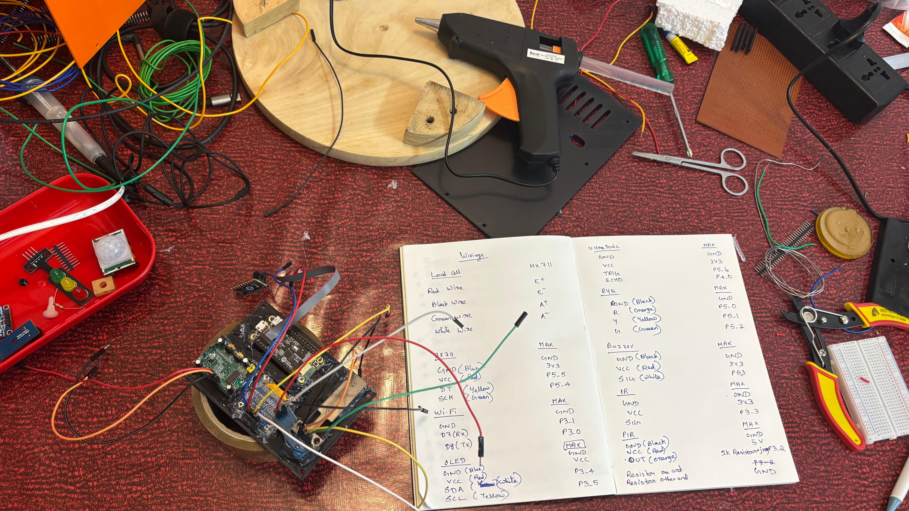

For the CAD design, I searched the GrabCAD library for 3D models of each individual sensor and component used in the system. I then imported the relevant models and integrated them into my overall enclosure design. After positioning and aligning each component based on the actual hardware dimensions and mounting requirements, I assembled and refined the complete CAD model to create the final prototype design.

### Enclosure Features

The enclosure is made up of multiple parts:

**Main Body** – Houses the main controller board and sensor modules, with dedicated cutouts for the Type-C port, display, RYG LED indicators, and piezo buzzer. A central opening provides access to the main board and simplifies installation and maintenance.

**Sensor Base** – Provides a dedicated mounting area for the HX711 module and load cell, allowing the weight-sensing mechanism to be securely integrated into the enclosure.

**Top Cover** – Provides a mounting surface for the IR sensor, ultrasonic sensor, positioned to face downward into the storage box for monitoring and inventory detection.

**Mounting & Fastening** – The enclosure is designed with mounting provisions to keep the internal components securely positioned and allow the complete node to be installed on the intended storage box.

**3D-Printed Construction** – The enclosure was fabricated using 3D printing based on the custom CAD design, allowing the dimensions and component cutouts to be tailored to the actual hardware.

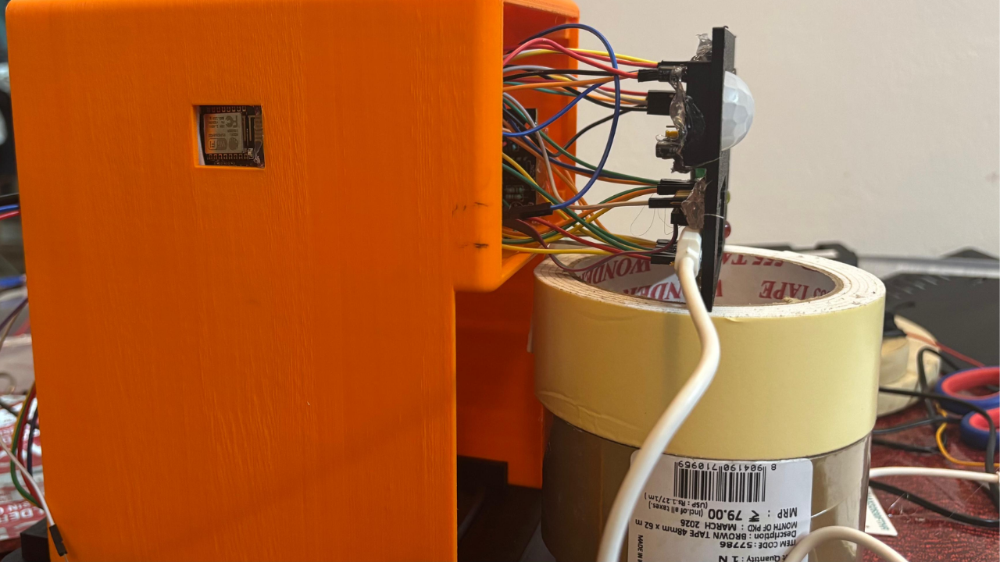

## Step 5: Hardware Assembly

After finalizing the CAD design, I sent the design files to a nearby 3D printing service and received the printed enclosure. With the mechanical structure ready, I could finally move on to integrating the sensor modules and communication hardware that had already been tested individually.

The next step was to carefully solder the required components and establish reliable electrical connections. The components that needed to be soldered included the RYG LED, piezo buzzer, HX711 module with the load cell, and other required sensor and communication connections. The soldering had to be done carefully, particularly because the available space inside the enclosure was limited and the components had to be positioned without interfering with one another.

**Pin Connections:**

#### load cell + HX711

| Load Cell | HX711 |
|---|---|
| Red Wire | E+ |
| Black Wire | E- |
| Green Wire | A+ |
| White Wire | A- |

#### HX711 + MAX32630FTHR

| HX711 pin | MAX32630FTHR |
|---|---|
| VCC | 3.3 V |
| GND | GND |
| DOUT | P5_5 (pin 45 in software) |
| SCK | P5_4 (pin 44 in software) |

#### Wi-Fi + MAX32630FTHR

| ESP Wi-Fi | MAX32630FTHR |
|---|---|
| GND | GND |
| D7 (RX) | P3_1 (TX) |
| D8 (TX) | P3_0 (RX) |

#### SSD1306 OLED Display + MAX32630FTHR

| OLED | MAX32630FTHR |
|---|---|
| VCC | 3V3 |
| GND | GND |
| SDA | P3_4 |
| SCL | P3_5 |

#### HCSR-04 Ultrasonic Sensor + MAX32630FTHR

| Ultrasonic | MAX32630FTHR |
|---|---|
| VCC | 3V3 |
| GND | GND |
| TRIG | P5_6 |
| ECHO | P4_0 |

#### RYG LED + MAX32630FTHR

| RYG | MAX32630FTHR |
|---|---|
| GND | GND |
| R | P5_0 |
| Y | P5_1 |
| G | P5_2 |

#### Piezo Buzzer + MAX32630FTHR

| OLED | MAX32630FTHR |
|---|---|
| VCC | 3V3 |
| GND | GND |
| SIG | P5_3 |

#### IR Sensor + MAX32630FTHR

| IR | MAX32630FTHR |
|---|---|
| VCC | 3V3 |
| GND | GND |
| O/P | P3_3 |

#### PIR Sensor + MAX32630FTHR

| PIR | MAX32630FTHR |
|---|---|
| VCC | 3V3 |
| GND | GND |
| OUT | 1K resistor one end |
| 1K resistor junction | P3_2 |
| 1K resistor other end | GND |

**Schematics:**

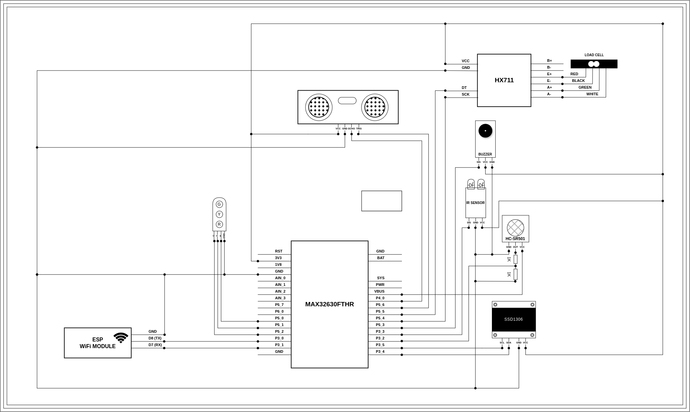

**Soldering Preparation**

Before starting the assembly, I prepared a clean and static-free workspace. The soldering iron was heated to approximately 350 °C for leaded solder or 370–380 °C for lead-free solder. Tweezers and flux were kept ready to handle the smaller pins and make the soldering process more precise.

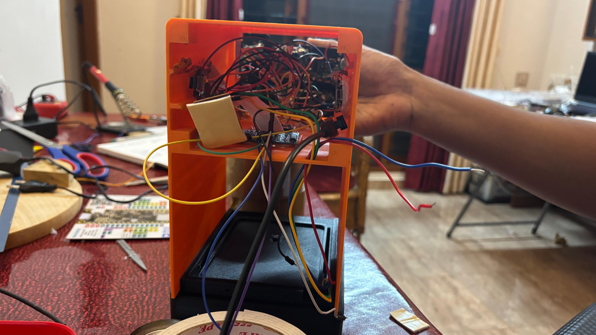

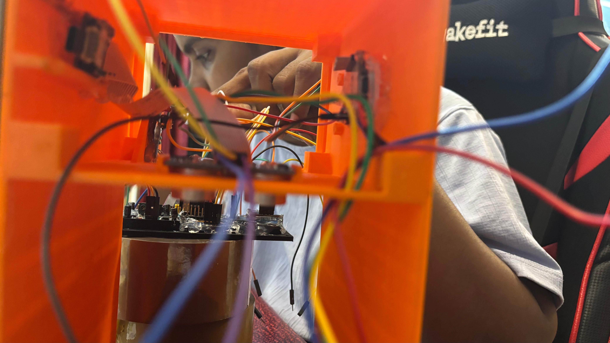

**Continuity Testing**

After soldering each module, I performed a continuity test using a multimeter in continuity mode. I checked the connection between each module pin and its corresponding PCB pad or trace. A beep or near-zero resistance indicated that the connection was electrically continuous and properly soldered.

Performing the continuity test after each component helped identify wiring or soldering problems early, before proceeding with the complete system integration.

## Step 6: Build Process

The build process came together over an intense 2 days of designing, 3D printing, soldering, testing, and troubleshooting. I started by fabricating the custom enclosure and then gradually integrated the sensor modules, communication hardware, indicators, buzzer, and weight-sensing components into the case.

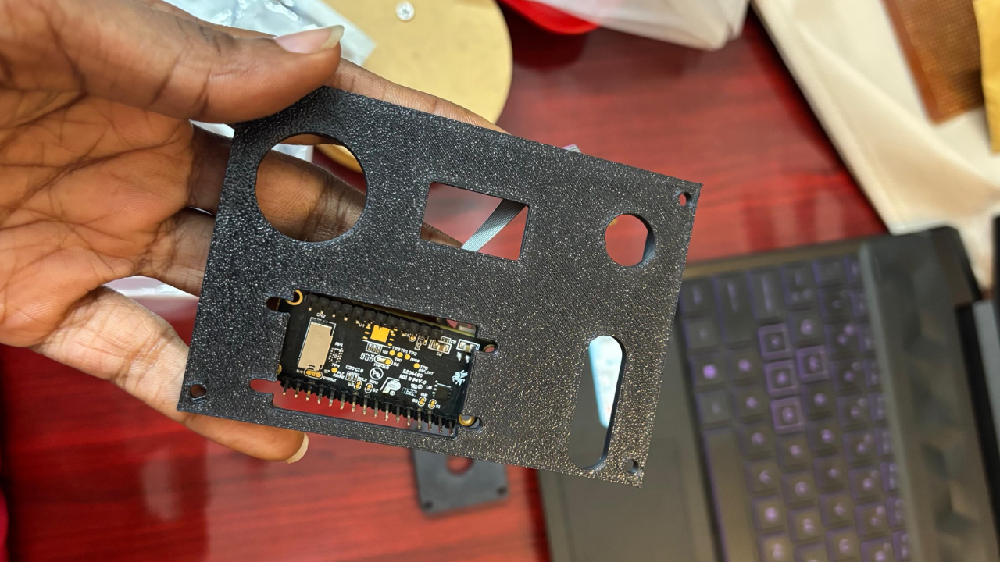

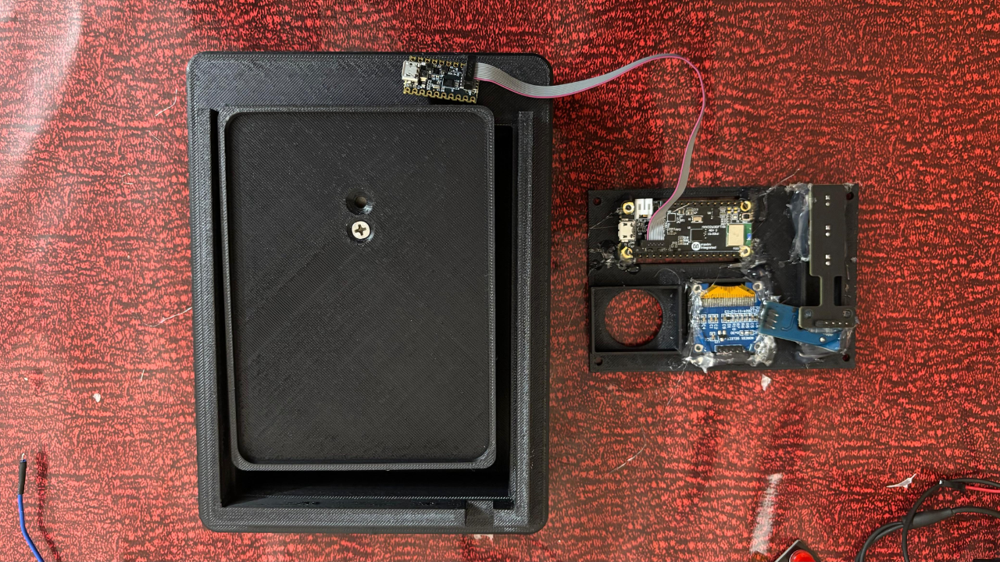

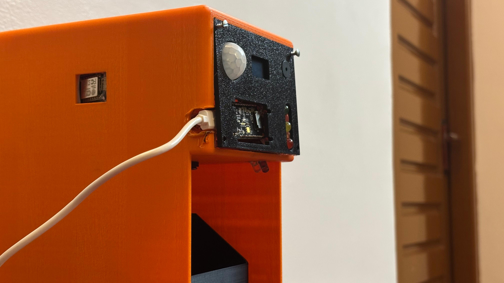

A Zero PCB was used to organize and simplify the wiring between the modules. It provided a convenient way to distribute GND and VCC connections and make the required signal connections between the different components, helping keep the wiring compact and organized inside the enclosure.

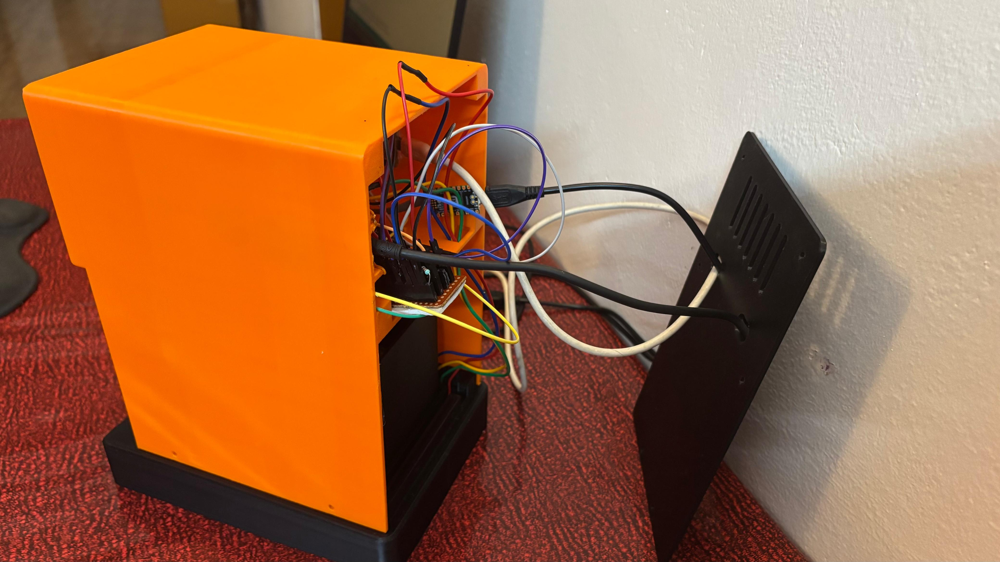

It wasn't a perfectly linear process. There were several rounds of testing, adjustments, wiring changes, and mechanical fixes to make everything fit and work together properly. Getting the load cell and HX711 working reliably, positioning the ultrasonic sensor and camera correctly, and fitting all the modules inside the 3D-printed enclosure required a lot of patience and trial and error.

These two days involved a lot of hands-on work and problem-solving. Each issue helped me better understand the practical challenges of combining electronics, sensors, wiring, and a custom 3D-printed enclosure into a single working system.

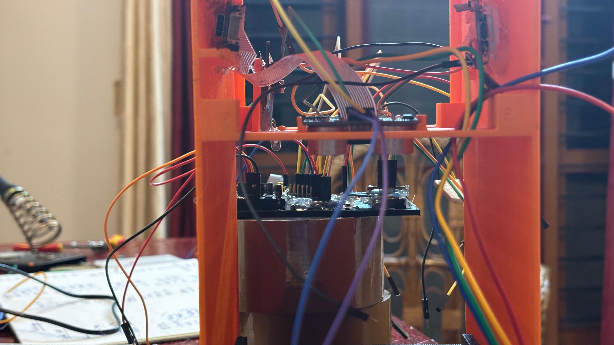

Each problem along the way helped me understand the system better, from electronics and soldering to mechanical design, sensor integration, and debugging. By the end, the enclosure had evolved from a CAD design into a working physical node with the components properly integrated and ready for the next stage of testing.

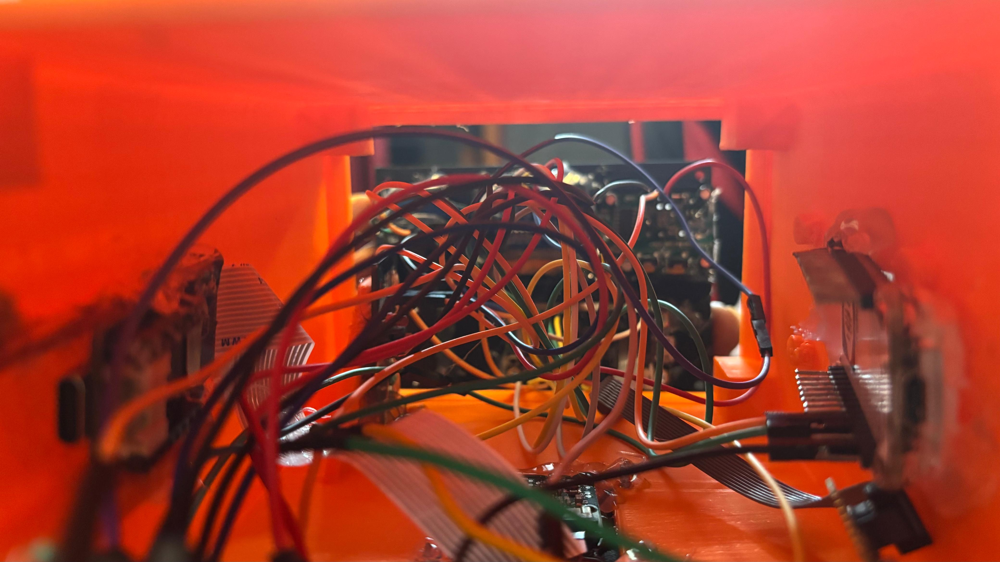

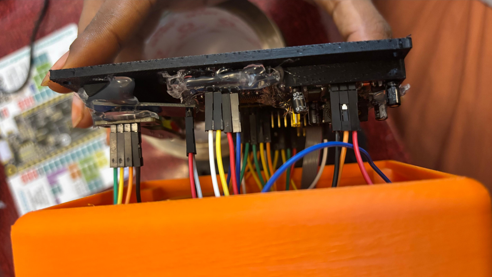

## Step 7: Final Assembly

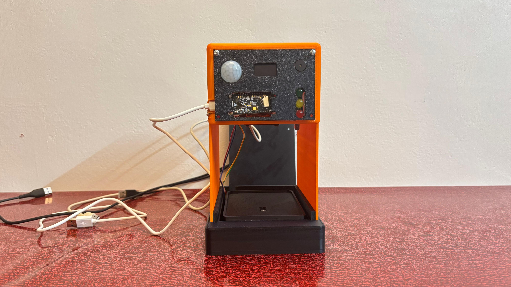

After integrating all the sensors, modules, wiring, and supporting electronics, the complete system was assembled inside the custom 3D-printed enclosure. The final assembly provided a compact and organized integration of the sensing and control components, with all major connections securely routed and the individual modules positioned according to the enclosure design. The completed unit represents the final physical implementation of the node, ready for testing and deployment.

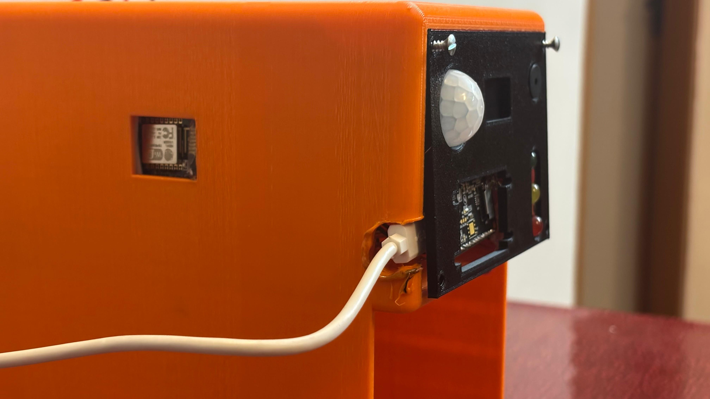

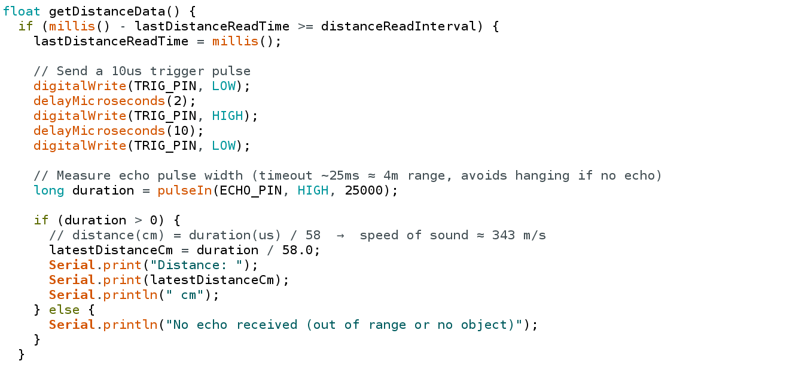

## Step 8: Hardware Testing and Troubleshooting

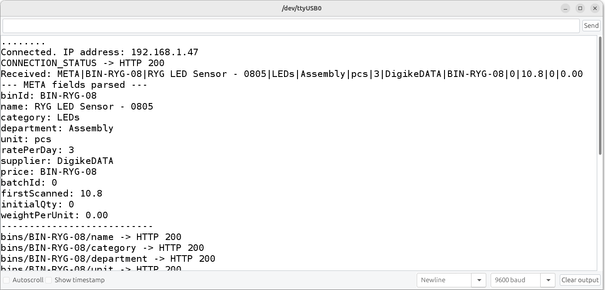

With the complete hardware assembly finished and only four days remaining before the final submission, the next priority was to verify that every sensor and module was functioning correctly. Since I had already prepared individual test setups for each sensor, the testing process was much easier and more systematic.

During the initial testing, I discovered that the display and RYG LED were not working at all. After checking the components, the issue was traced back to wiring problems rather than faulty hardware. I had to rewire both modules and test the connections again. This troubleshooting and rewiring process took nearly four hours, but eventually both the display and RYG LED were working perfectly.

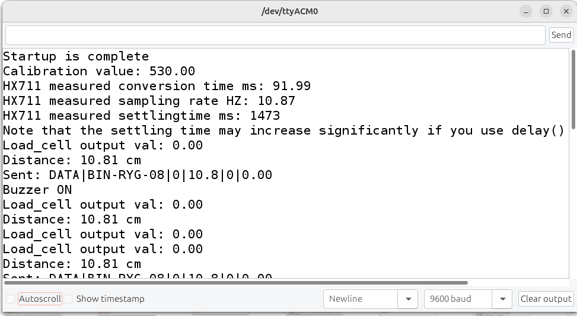

After resolving these issues, I went through each sensor and module individually once again to verify their operation. This final round of individual testing gave me confidence that the components were functioning correctly before moving forward with the complete integrated system.

## Step 9: Sensor Integration and Demo Implementation

After completing the individual testing of each sensor, the next major step was to combine the separate sensor programs into a single working demonstration. This was more involved than simply merging the code, because each sensor had its own initialization, reading method, timing requirements, and output logic. I had to make sure that adding one sensor did not interfere with the operation of the others.

For the initial demonstration, I decided to use the RYG LEDs as the primary inventory item, since they were available in sufficient quantity for repeated testing. I then built the inventory monitoring logic around the actual measurements obtained from the hardware.

The first step was integrating and calibrating the load cell with the HX711. I measured the weight of an empty tray, which was approximately 55 g, and then measured an individual RYG LED, which was approximately 3.55 g. The tray weight therefore had to be separated from the actual inventory weight before calculating the quantity.

The approximate number of LEDs can be calculated using:

Number of LEDs = (Measured Weight − Empty Tray Weight) / Weight of One LED

For example, if the measured weight of the tray and LEDs is 232.75 g:

Inventory weight = 232.75 − 55 = 177.75 g

Estimated LED count = 177.75 / 3.55 ≈ 50 LEDs

This provided a practical way to estimate the remaining inventory from the load-cell measurement rather than manually counting every LED.

I then introduced the inventory thresholds into the system. For the demonstration, the full inventory was considered to be 13 LEDs. When the estimated count falls below 50% of the initial inventory, the RYG indication is used to alert the worker that the stock level is decreasing. This makes the worker the first point of awareness, allowing the shortage to be identified and reported before the situation becomes critical.

When the estimated inventory falls below 20%, the system enters a more critical state. A red LED indication is activated along with a 10-second buzzer. The buzzer is specifically intended to make the severity of the situation more noticeable, so that the worker can immediately recognize that the remaining inventory requires urgent attention and notify the store manager.

**Challenges During Sensor Integration**

The integration itself required several iterations. The individual sensor programs worked correctly when tested separately, but combining them introduced new problems. I had to coordinate the sensor initialization, reading intervals, calculations, threshold checks, and output indications within the same program without blocking the operation of other sensors.

For example, the weight sensor cannot simply be treated as an instantaneous reading. Its values need to be read and processed carefully to avoid fluctuations being interpreted as actual inventory changes. Similarly, the IR sensor needed to be considered together with the weight measurement so that a detected object removal could be correlated with an actual decrease in inventory.

I therefore added the IR sensor as a second source of information. When a worker removes an LED or another component, the IR sensor can detect the removal while the load cell checks whether the overall weight has also decreased. Using these two observations together provides an additional verification mechanism instead of relying entirely on a single sensor.

I also integrated the ultrasonic sensor to provide another measurement of the inventory level. The sensor measures the distance between itself and the objects inside the bin. When more objects are present, the surface of the inventory is closer to the sensor, resulting in a smaller measured distance. As the inventory decreases, the distance increases. This gives another physical measurement that can be compared with the weight-based estimation.

Bringing these sensors together required repeated testing because the readings do not behave identically. Weight measurements can fluctuate, IR detection represents an event, and ultrasonic sensing provides a distance value that changes continuously. The challenge was therefore not only to make each sensor work, but to make their outputs contribute meaningfully to the same inventory-monitoring logic.

These combined sensor tests formed the offline implementation and demonstration setup for the project. The objective at this stage was to validate the complete sensing concept using measurable inventory changes before moving toward the final integrated implementation.

## Step 10: IoT Integration and Firebase Data Flow

After completing the offline sensor integration and validating the inventory logic, the next step was to add the IoT layer. The objective was to take the data already being generated locally by the sensors and make it available remotely through Firebase.

The overall data flow was structured as:

**Sensors → Main Controller → Wi-Fi Module → Internet → Firebase → Dashboard / Prediction**

The main controller first collects the readings from the different sensors. These include the estimated inventory count, load-cell weight, IR detection status, ultrasonic distance, and inventory-level indication. The controller processes these raw sensor readings locally and generates the values required by the inventory-monitoring logic.

### Wi-Fi Integration

To transfer this information to the cloud, I integrated a Wi-Fi module with the controller. The first stage was establishing communication between the controller and the Wi-Fi module. The Wi-Fi module was configured with the required network credentials and used to establish an internet connection.

Once the connection was available, the controller could send the processed sensor values through the Wi-Fi interface. I had to ensure that the communication between the controller and Wi-Fi module was working correctly before attempting to send data to Firebase. This involved checking the transmitted values and making sure that the sensor readings being generated locally were reaching the communication layer correctly.

After establishing the Wi-Fi connection, I configured the system to transmit the inventory-related data to Firebase. Instead of treating each sensor independently, the relevant readings were sent as part of the inventory data generated by the node.

### Firebase Data Flow

The data flow begins when a sensor produces a physical measurement. For example, the load cell measures the weight of the contents, which is processed to estimate the number of LEDs remaining. Similarly, the IR sensor provides object-removal information, while the ultrasonic sensor provides the distance to the inventory.

The controller processes these readings and prepares the corresponding values for transmission. The Wi-Fi module then sends the data over the internet to Firebase, where the values can be stored and accessed remotely.

This creates a continuous path from the physical inventory to the cloud:

**Physical Inventory → Sensor Measurements → Local Processing → Wi-Fi Transmission → Firebase Storage**

With the data now available in Firebase, the same dataset can be used for the next stages of the project. The immediate goal is to use it for remote inventory visualization, allowing the current inventory status and sensor readings to be displayed without directly accessing the hardware. The accumulated historical data can then provide the input required for inventory trend analysis and prediction.

This IoT integration therefore forms the bridge between the physical sensing system and the software side of the project, allowing the measurements collected by the node to become remotely accessible data rather than remaining only on the device.

## Step 11: GUI and Inventory Management Dashboard

After completing the hardware and IoT integration, the next stage was to develop the GUI for inventory monitoring and management. Since the system is intended for factory production environments and store or stock managers, I chose a dashboard layout inspired by the type of Power BI-style interfaces commonly used for industrial and business data monitoring. The focus was to make the important inventory information visible without requiring the manager to go through individual sensor readings.

The main dashboard begins with an inventory overview, providing a quick summary of the current stock situation. Below this, individual components are displayed along with their estimated remaining inventory and the number of days before they are expected to go out of stock. Charts are also provided for individual components so that managers can understand inventory levels and changes more easily through visual trends rather than relying only on numerical values.

The dashboard also includes category-based searching and filtering, allowing managers to select a particular product category and view the corresponding inventory information. The system can also display the contents of individual storage bins, including the estimated quantity of components currently present in each bin.

Another part of the interface focuses on inventory trends. Graphs are used to show how stock levels and consumption rates change over time, making it easier to identify increasing or decreasing inventory trends. Historical inventory information, including previous-year data, is also included to provide a basis for comparing current stock behaviour with past records.

Since the system may be used for extended periods, I also added a night mode to make the dashboard more comfortable to use in low-light environments.

At the current prototype stage, the RYG LED inventory is the primary real-time dataset connected to the dashboard. Its quantity and inventory status are updated using the data received from the physical sensing system. The other components and interface elements are being used to demonstrate how the system can be extended as more real-time inventory data becomes available.

### Invoice PDF Tracking

I also added a separate invoice PDF tracking feature to make inventory updates easier to manage from existing company records. The idea is to allow relevant invoice documents to be associated with inventory transactions rather than requiring the store manager to manually search through separate records.

By tracking invoice information alongside inventory data, the manager can refer back to the corresponding purchase or stock information when required. This provides an additional connection between the physical inventory, the digital inventory records, and the documentation associated with stock movement.

### Inventory Prediction and Alerts

For the initial prediction implementation, I used a Linear Regression model to analyse the available inventory data and estimate future stock behaviour. The model uses the collected inventory information to generate a prediction of the expected stock trend. The implementation details and model-related code are documented separately in the project's GitHub repository.

Github Documentations: [https://github.com/mydhily-mr/aiot-inventory-predictor/tree/main/docs](https://github.com/mydhily-mr/aiot-inventory-predictor/tree/main/docs)

The prediction system is also connected to an email alert mechanism. When the predicted or monitored inventory reaches a low-stock condition, the system can generate an email notification so that the responsible person can take action before the component is completely depleted.

At this stage, both the GUI and the AI prediction model are hosted locally, since the current implementation is a prototype. The local setup allows me to test the complete workflow, from sensor data collection and Firebase transmission to dashboard visualization, prediction, and alert generation, before moving toward a fully deployed production system.

## Step 12: Final Outputs and Demonstration Results

The final outcome of the project is a working AIoT-based inventory monitoring prototype that connects the physical inventory sensing system with cloud data storage, a management dashboard, and an inventory prediction module.

The completed hardware node integrates the load cell and HX711, IR sensor, ultrasonic sensor, RYG indicators, display, buzzer, Wi-Fi module, and supporting electronics within the custom 3D-printed enclosure. The individual sensors were tested separately before being integrated, and the final assembly was then tested as a complete system.

During the final demonstration, the RYG LEDs were used as the primary inventory item. The load cell was calibrated using an empty tray weight of approximately 55 g, while the measured weight of a single RYG LED was approximately 3.55 g. These measurements were used to estimate the number of LEDs remaining based on changes in the total measured weight.

| Light | Rule | Demo bin (capacity 12) |
|---|---|---|
| Green | above 50% | 7 to 13 pieces |
| Yellow | 21% to 50% | 3 to 6 pieces |
| Red | 20% or less | 0 to 2 pieces |

The inventory logic was demonstrated using two stock-level thresholds. When the estimated inventory falls below 50%, the system provides an RYG indication to notify the worker that the stock level is decreasing. When the inventory falls below 20%, the system activates the red indicator and a 10-second buzzer alert, representing a more critical shortage that requires the worker to notify the store manager.

The IR sensor and ultrasonic sensor were also incorporated into the demonstration as additional inventory measurements. The IR sensor provides an indication when a component is removed, while the ultrasonic sensor measures the distance to the inventory inside the bin. These readings provide additional information that can be compared with the weight-based inventory calculation.

### IoT and Dashboard Results

The sensor readings generated by the physical node were successfully passed through the Wi-Fi communication layer to Firebase. This established the complete data path from the physical inventory to the cloud database.

The dashboard then uses the available data to present the inventory information in a manager-oriented interface. The final GUI includes an inventory overview, component-level stock information, estimated days remaining, category-based filtering, individual bin information, inventory trend charts, and historical data. A night-mode interface was also implemented for easier extended use.

At the current prototype stage, the RYG LED inventory is the primary real-time dataset displayed in the dashboard. Changes made to the physical inventory are reflected in the corresponding inventory data, demonstrating the connection between the hardware sensing layer and the software interface.

### Prediction and Alert Results

The prediction module was implemented using Linear Regression to analyse the available inventory data and estimate future stock behaviour. The predicted inventory information is intended to help identify potential shortages before the stock reaches a critical level.

An email notification mechanism was also implemented as part of the prototype. When the inventory reaches the defined low-stock condition, the system can generate an alert for the responsible personnel. This extends the system beyond passive monitoring by providing a mechanism for notifying the user when attention is required.

### Overall Demonstration

The final prototype demonstrates the complete workflow:

**Inventory → Sensors → Controller → Wi-Fi → Firebase → Dashboard → Prediction → Email Alert**

The final output is therefore not limited to a physical sensing node. It demonstrates an integrated workflow in which inventory changes are detected at the hardware level, processed locally, transmitted to the cloud, visualized through a management dashboard, analysed for future stock behaviour, and used to generate alerts.

The current implementation is intentionally maintained as a local prototype for demonstration and validation. It provides the complete functional foundation that can later be extended with additional inventory categories, larger datasets, improved prediction models, and production-level deployment.

---

## Schematics

## Project Video:

**[https://youtu.be/odlPvgT5Zeg?si=Ek_2I9EwPxp-R_3K](https://youtu.be/odlPvgT5Zeg?si=Ek_2I9EwPxp-R_3K)**

## Code:

**(Any: Github link, Drive link, Dropbox supported shared with viewer rights)**

LInk:- **[https://github.com/mydhily-mr/aiot-inventory-predictor](https://github.com/mydhily-mr/aiot-inventory-predictor)**