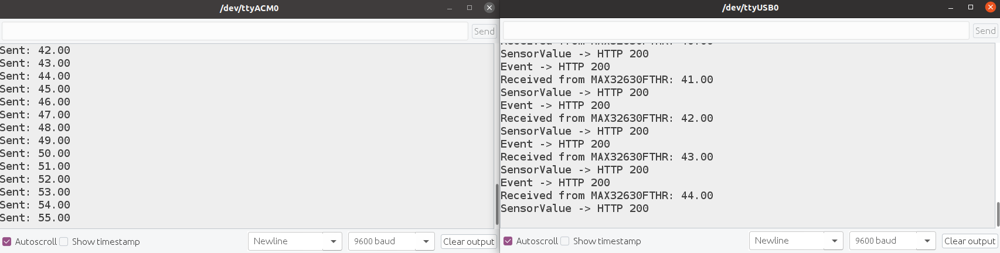
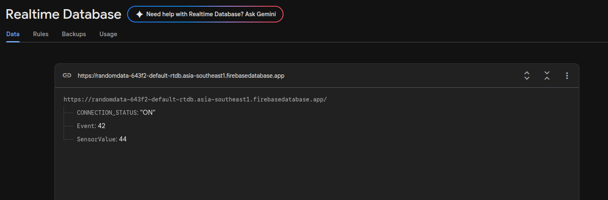

# Individual Sensor Testing

# WiFi Module Interfacing — MAX32630FTHR + NodeMCU (ESP8266)

### Goal

The MAX32630FTHR (this project's main board, per the competition abstract) has no
built-in WiFi. This session covers getting sensor data off the MAX32630FTHR and
into Firebase Realtime Database over WiFi, using a NodeMCU (ESP8266) as a
dedicated WiFi bridge.

### Issues faced and how each was solved

1. **`dtostrf()` not declared.** Used to format the sensor float as a string;
   this AVR-only convenience function isn't implemented on this core. Fixed by
   using standard `sprintf(buf, "%.2f", value)` instead — confirmed safe on
   this core by checking its link flags (`--specs=nosys.specs`, full newlib,
   not the stripped `newlib-nano` that famously breaks floating-point
   `sprintf` on some ARM cores).

2. **`Serial2.begin()` silently did nothing — no error, no data, ever.**
   Root-caused by manually replicating the core's internal `UART_Init()` call
   to capture its return code (the wrapper discards it — the source literally
   comments `// Fail silently`). It returned `-17` / `E_NOT_SUPPORTED`.
   Traced through `mxc_sys.c`/`uart.c`: **this chip shares one clock divider
   across every UART peripheral**, and whichever UART calls `.begin()` first
   locks that shared clock to its own needs. The debug console
   (`Serial.begin(115200)`) ran first, leaving no valid clock divisor for
   `Serial2`'s `9600` baud. **Fixed by matching both UARTs to the same baud
   rate (9600)**, removing the conflict entirely.
   → Filed as a GitHub issue against `analogdevicesinc/arduino-max326xx`.

3. **The original request/response protocol design could deadlock.** NodeMCU
   only sent a request when it first saw incoming bytes; MAX32630FTHR only
   replied when it received a request — a design where, after one exchange,
   both sides could end up silently waiting on each other. **Redesigned to a
   simpler push-based protocol**: MAX32630FTHR sends a fresh reading
   unprompted every 2 seconds; NodeMCU just listens continuously and relays.
   Removes the deadlock risk architecturally rather than patching around it.

6. **Confusion after it started working**, seeing different values across the
   MAX32630FTHR monitor, the NodeMCU monitor, and Firebase. Not a bug — with
   a random test value changing every 2 seconds, three independently
   scrolling views with no shared timestamp are genuinely hard to
   eyeball-correlate. Resolved by temporarily swapping the placeholder for a
   simple incrementing counter, making the correct sequence unambiguous to
   verify across all three views.

*(Time taken: I spent almost 1 week in resolving the wifi part itself. It was difficult earlier, since with arduino there were very less or no examples for uart sensors but ultimately i was happy that i got it working.)*

### Final working setup

**Hardware:** MAX32630FTHR, NodeMCU (ESP8266).

**Wiring** :
| MAX32630FTHR | NodeMCU |
|---|---|
| P3_1 (Serial2 TX) | D7 (RX) |
| P3_0 (Serial2 RX) | D8 (TX) |
| GND | GND |

Power is given to both boards seperately.

**Logic:**
1. MAX32630FTHR takes a sensor reading every 2 seconds and sends it as a text
   line (`Serial2.println(...)`) — no request needed, no handshake.
2. NodeMCU listens continuously on `SoftwareSerial` (D7); whenever a full line
   arrives, it's parsed and pushed to Firebase via an HTTPS `PUT` request,
   along with a separate incrementing `Event` counter.
3. Firebase stores the latest `SensorValue` and `Event` at fixed paths
   (overwritten each time — not a running history log).

**Key fix underpinning all of it:** both UARTs (`Serial` and `Serial2`) must
be initialized at the **same baud rate**, due to the shared clock divider
described in issue #2 above.

## Output:

  — Click on Install and wait for the installation to be completed.

 — Click on Install and wait for the installation to be completed.

### Coming Next...
- **I2C integration (Grove Vision AI Module V2)** was designed and discussed
  as a next step, but not yet implemented or tested — it would sit on a
  separate I2C bus from this UART link, with MAX32630FTHR as I2C master.
