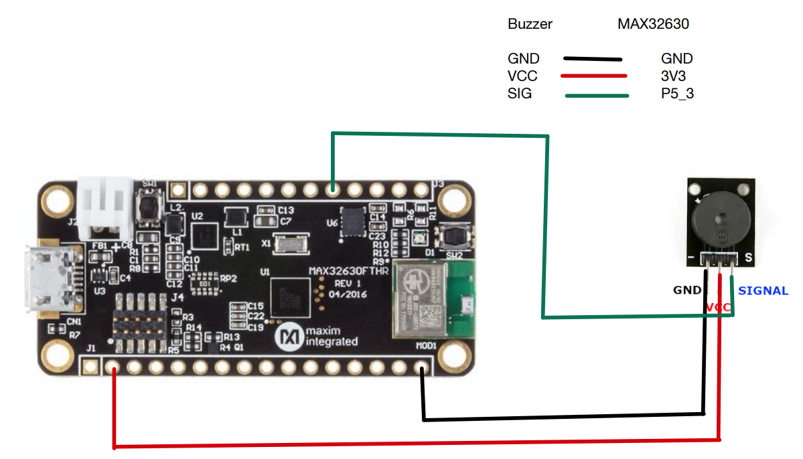
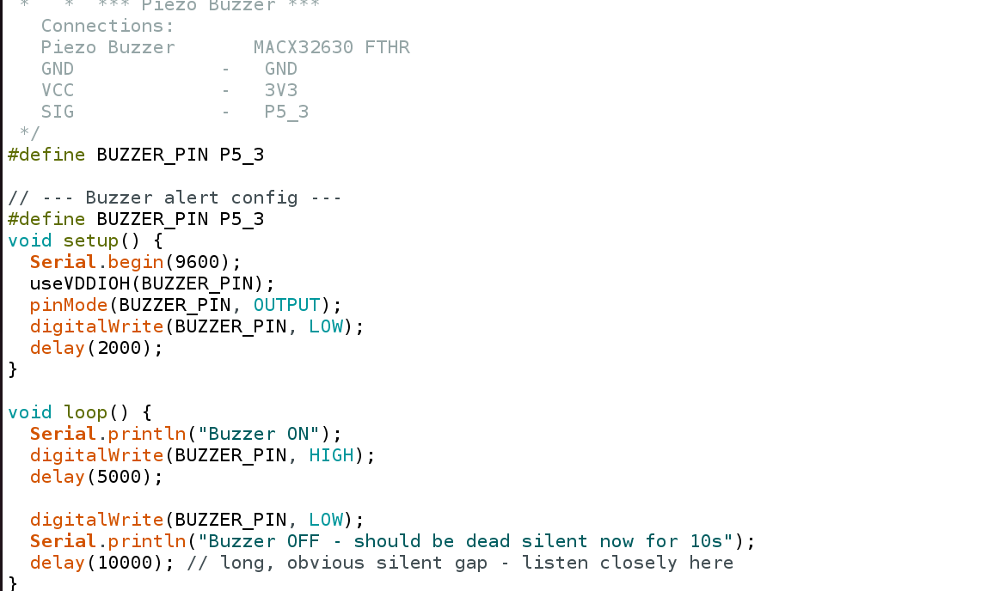

# Individual Sensor Testing

# Piezo Buzzer with MAX32630 FTHR

### Goal

Interfacing Buzzer with MAX32630fthr board.

**Schematic:**
 — Buzzer

**Wiring** :
| RYG  | MAX32630FTHR |
|---|---|
| GND   | GND |
| VCC    | 3V3 |
| SIG    | P5_3  |

**Code Snippet:**
 —Buzzer

