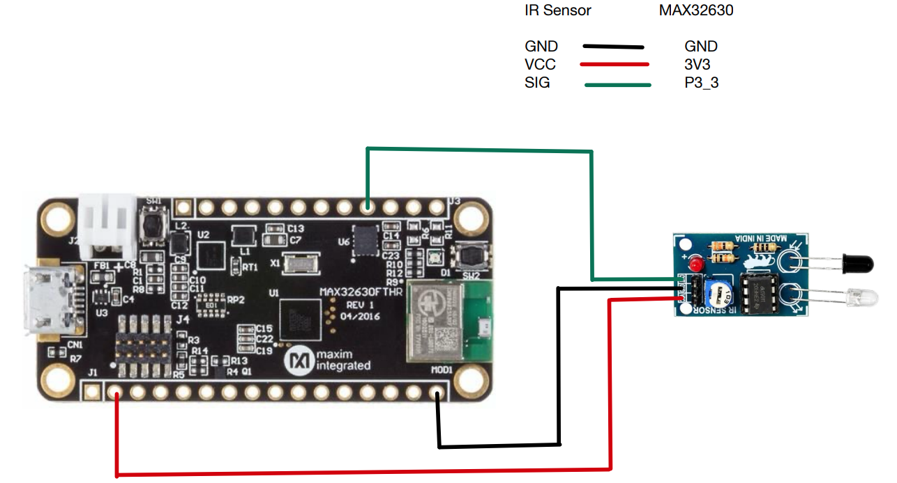

# Individual Sensor Testing

# IR Sensor with MAX32630 FTHR

### Goal

Interfacing IR Sensor  with MAX32630fthr board.

### Final working setup

**Schematic:**
 — RYG

**Wiring** :
| IR  | MAX32630FTHR |
|---|---|
| GND   | GND |
| VCC    | P5_0 |
| O/P    | P3_3  |

