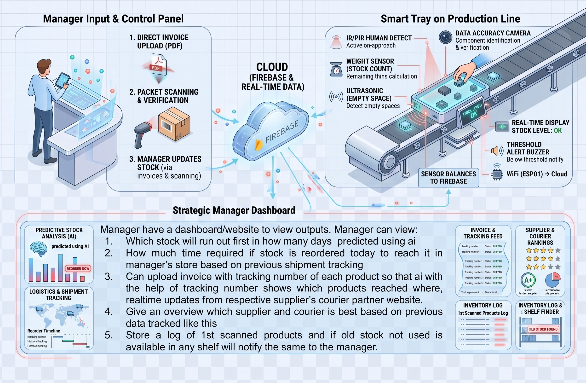
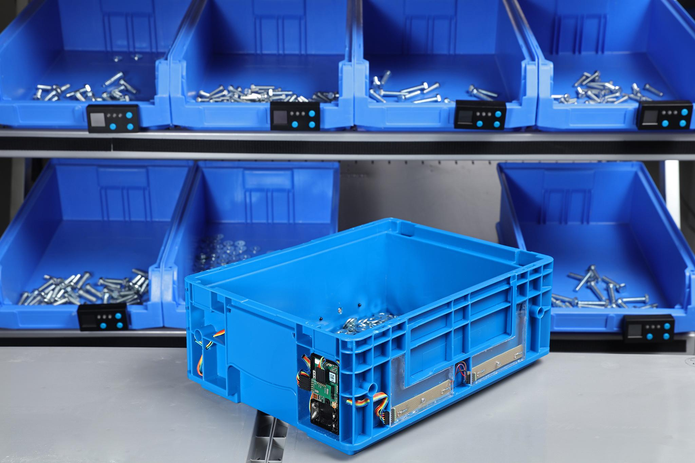
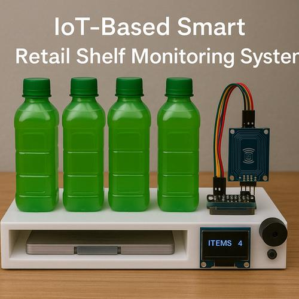
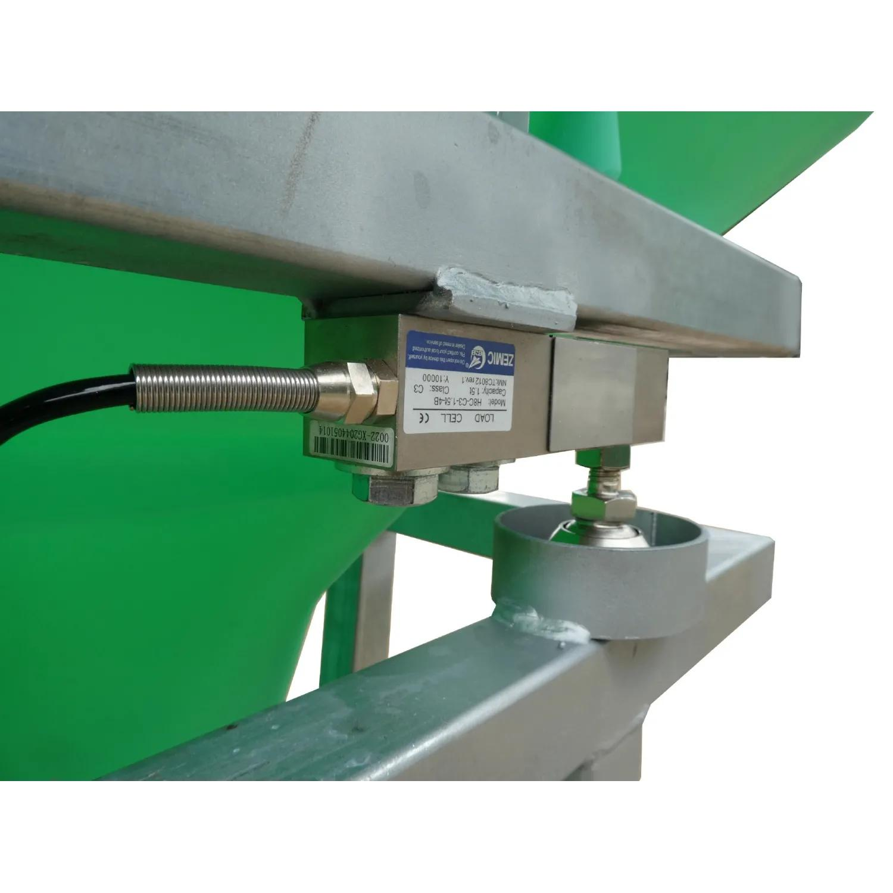
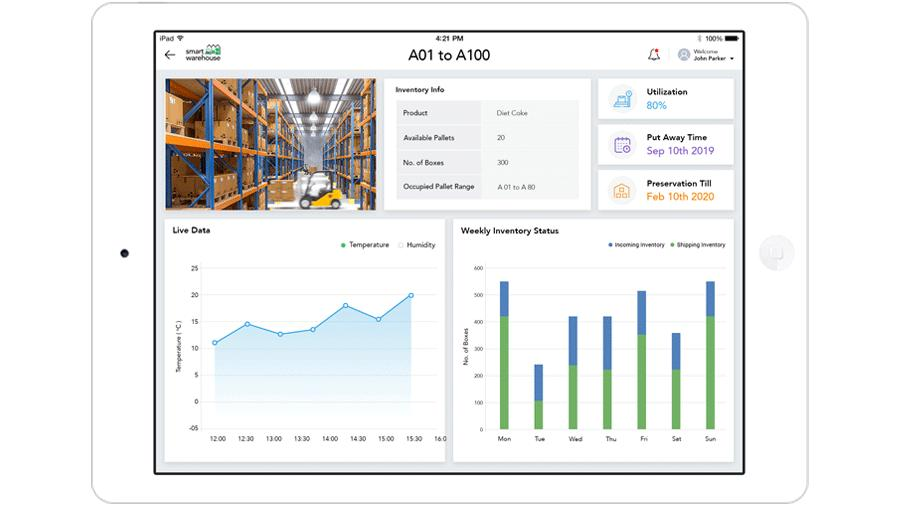

[← Back to README](../README.md)

## Introduction
<!-- **14 Aug 2026** -->

### Data Collection

Feedback was gathered from real inventory users about common problems in physical stock rooms:

| # | Identified Issue | How PRISM addresses it |
|---|---|---|
| 1 | Manually updating stock in software takes too much time. | Automated sensor updates: load cell → Wi-Fi → cloud database. |
| 2 | Stock-outs are noticed too late, usually when the bin is already empty. | Local RYG LED + buzzer warning, plus AI days-to-empty forecast. |
| 3 | It's hard to know exactly where things are and how much is left in each bin. | OLED on every bin showing live count, and a web dashboard for the stock manager. |
| 4 | Nobody knows how fast a component is really being consumed. | Hand-pick detection (IR) and weight-drop history feed a consumption-rate model. |

**Existing Systems**

FIFO
- The components received first are used first. This helps prevent old or perishable components from remaining in inventory for too long. PRISM stores each delivery as a separate batch so the oldest batch can be identified.

Kanban System
- Uses visual signals, such as cards or digital alerts, to indicate when components need to be replenished. PRISM's green / yellow / red LED and buzzer work as a digital Kanban signal at the bin itself.

Lean Manufacturing
- Focuses on reducing waste, excess inventory, and unnecessary processes. The goal is to keep only the inventory needed for production.

Six Sigma
- Uses data and statistical methods to reduce errors and variation in processes. In inventory management, it can help improve demand forecasting and reduce inventory-related mistakes.

Bulk Manufacturing
- Produces large quantities of products or components at once. This can reduce production costs but may lead to excess inventory if demand is not accurately predicted.

**Current situation vs. our improved model**

Most inventory systems only ask *"How much stock do we have?"*

Our system asks four questions instead:
- Is the **quantity** correct, right now, without anyone counting?
- Is anyone **picking** from the bin, and how fast?
- Is the bin **running low**, and is the worker warned on the spot?
- **When will it run out**, so it can be reordered in time?

### Implementation Model

   *Sample Output*

> **`Fig 1.1`** — System architecture flowchart (Smart Inventory Bin → Load Cell / IR / Ultrasonic → MAX32630FTHR → NodeMCU Wi-Fi gateway → Firebase Realtime Database → Web Dashboard + AI Forecast)

The flow works like this:

1. **Three sensors feed the controller:**
   - **Load cell + HX711** → *"How many?"* (quantity from weight)
   - **IR reflective sensor** → *"Is someone picking?"* (hand-pick estimate)
   - **HC-SR04 ultrasonic** → *"How full is the bin?"* (fill level)
2. All sensors feed the **MAX32630FTHR** microcontroller, which calculates the piece count and drives the **OLED**, the **RYG LEDs** and the **buzzer** locally. The bin keeps warning the worker even if Wi-Fi is down.
3. The MAX32630FTHR sends compact `META` (bin details, every 30 s) and `DATA` (live readings, every 2 s) messages over UART to a **NodeMCU (ESP8266)**.
4. The NodeMCU writes them to **Firebase Realtime Database** over HTTPS.
5. The **web dashboard** reads Firebase live and shows stock, batches, days left and alerts to the stock manager.
6. A **Python forecasting script** (scikit-learn linear regression on weight history) writes a days-to-empty prediction back to Firebase, and the dashboard shows it with an AI badge.

**What each part tracks:**

| # | Thing to Track | Description | Solution |
|---|---|---|---|
| 1 | Quantity | How many pieces are in the bin? | Load cell + HX711; count = (weight − container tare) ÷ weight per piece |
| 2 | Picking activity | Is a hand taking parts out? | IR reflective sensor (estimated picks, cross-checked with weight drop) |
| 3 | Fill level | How full is the bin? | HC-SR04 ultrasonic distance |
| 4 | Local warning | Does the worker know the bin is low? | RYG LEDs + buzzer + OLED |
| 5 | Future availability | When will the bin be empty? | AI days-to-empty forecast |
| 6 | Remote visibility | Can the manager see every bin? | Firebase + web dashboard |

**Design note.** The first concept used a camera and RFID to verify that the *right* component was in the bin. This prototype focuses on counting, warning and forecasting using weight, IR and ultrasonic sensing only. Component identity checking by camera or RFID is left as a future extension.

### Circuit Diagram & Wiring

**Pin-connection reference** (MAX32630FTHR; verify against the final wiring before publishing):

| Component | Interface | MAX32630FTHR Pin(s) | Notes |
|---|---|---|---|
| HX711 + load cell | Digital (DT / SCK) | see sketch | One HX711 per bin |
| OLED (SSD1306) | I²C | `SDA`, `SCL` | Shows count with + / − change |
| HC-SR04 ultrasonic | Digital | `P5_6`, `P4_0` | Trigger / echo (use `useVDDIOH`) |
| IR reflective sensor | Digital in | `P3_3` | Hand-pick detection |
| Red / Yellow / Green LEDs | Digital out | `P5_0`, `P5_1`, `P5_2` | Each with a series resistor |
| Buzzer | Digital out via NPN transistor | `P5_3` | Active-LOW in this build (LOW = on) |
| NodeMCU gateway | UART (Serial2, 9600) | `TX`, `RX` | Wi-Fi to Firebase |

### Complete Product

**Pipeline:** `Sense → Count → Warn → Predict`

### Components Required

**Hardware used in the prototype:**

| Hardware | Purpose | Quantity |
|---|---|---|
| MAX32630FTHR | Edge controller | 1 |
| Load cell | Weight measurement | 1 |
| HX711 | Load-cell interface | 1 |
| OLED display (SSD1306) | Local count and status display | 1 |
| IR reflective sensor | Hand-pick detection | 1 |
| HC-SR04 ultrasonic sensor | Fill-level measurement | 1 |
| Red / Yellow / Green LEDs | Stock status indication | 3 |
| Buzzer + NPN transistor | Critical low-stock alert | 1 |
| NodeMCU (ESP8266) | Wi-Fi gateway to Firebase | 1 |
| Storage bin | Physical inventory container | 1 |
| Breadboard | Prototyping | 1–2 |
| Wires / connectors / resistors | Interconnects | As required |

**Future work (not in this prototype):**

| Hardware | Purpose |
|---|---|
| Camera | Component identity verification |
| RFID reader and tags | Automatic bin identification |
| Temperature / humidity sensor | Environmental monitoring |
| Multiple bins on one gateway | Scaling to a full shelf |
| Custom PCB | Final prototype consolidation |

**Reference builds / inspiration:**

 — "IoT-Based Smart Retail Shelf Monitoring System" demo: bottles on a shelf next to a reader module and an OLED showing item count.

 — Load cell mounted under a shelf bracket (close-up of the sensor and mounting hardware).

 — Tablet dashboard mockup showing inventory info, live graphs and a weekly inventory bar chart.

 — Warehouse shelving fitted with labeled bins and IoT gateway/sensor modules along the shelf rail.

---
[← Back to README → ](../README.md)