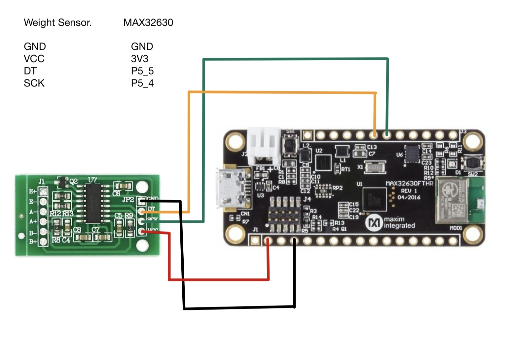
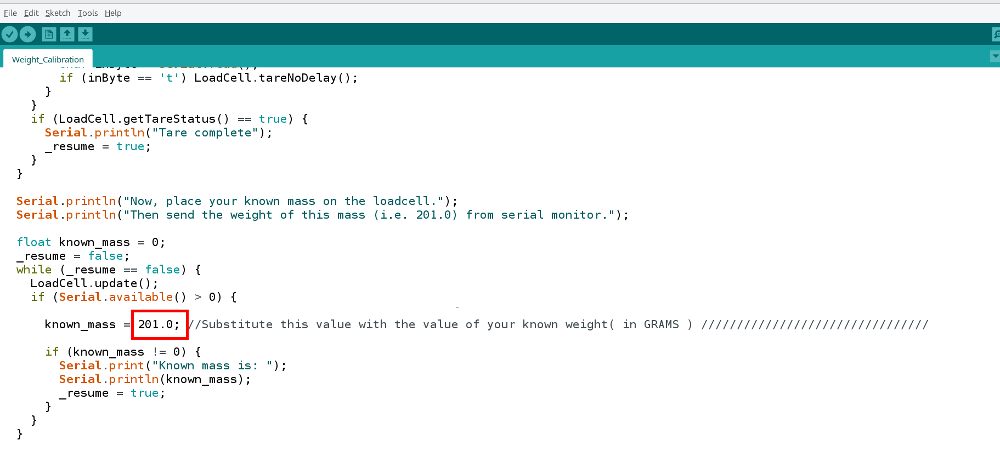
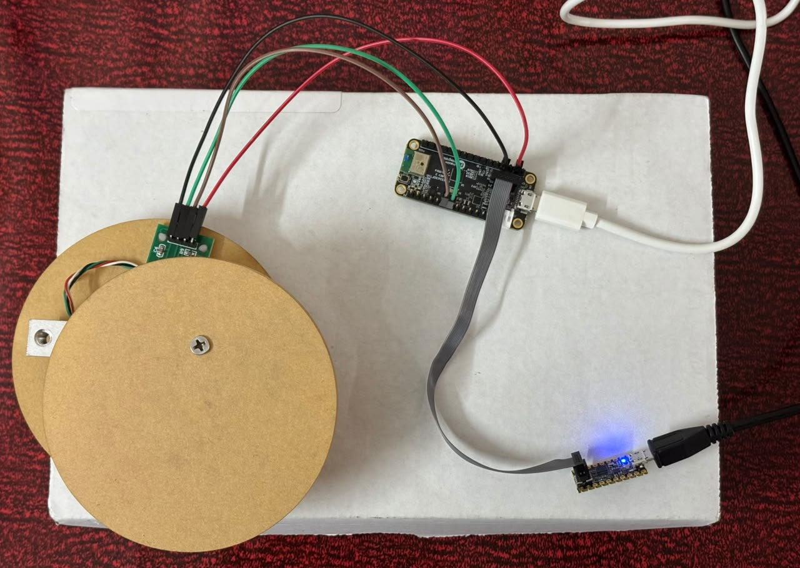
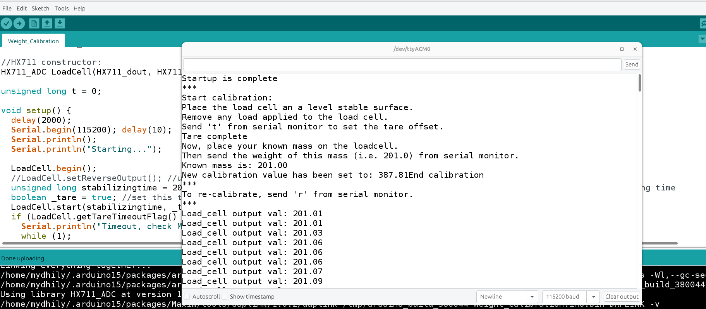
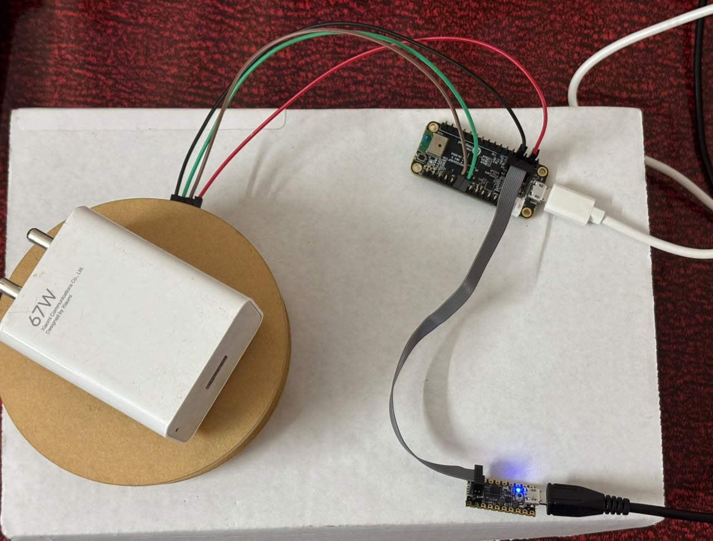
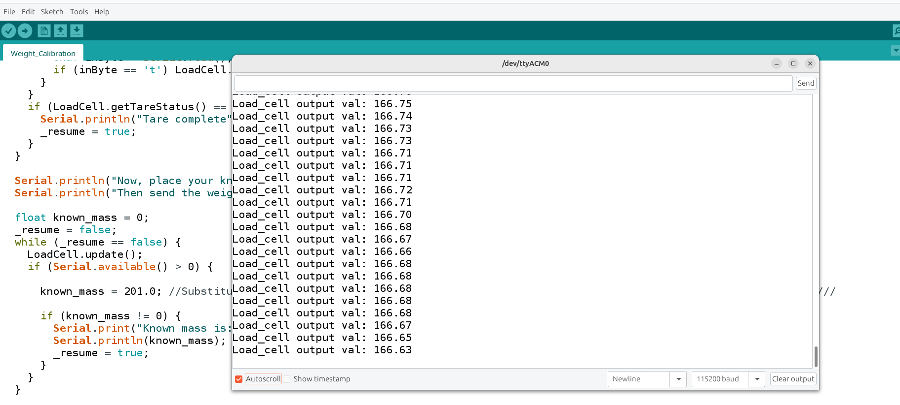

# Individual Sensor Testing

# HX711 Weight Sensor

### Goal

Interfacing HX711 weight sensor with MAX32630fthr board.

### Final working setup

**Hardware:** MAX32630FTHR, NHX711 Weight sensor 5Kg

**Wiring** :
| Weight Sensor  | MAX32630FTHR |
|---|---|
| GND   | GND |
| VCC   | 3V3 |
| DT    | P5_5 (pin 45 in software) |
| DSCK  | P5_4 (pin 45 in software) |

  — weight_sensor Connection.

**Code Snippet:**
 — weight_sensor Known mass value to change.

## Output:

  — weight_sensor connection.

  — weight_sensor calibration output with known weight.

 — weight_sensor  output for objects with unknown weights.

  — weight_sensor  output for objects with unknown weights.

### Coming Next...
- **I2C integration (Grove Vision AI Module V2)** was designed and discussed
  as a next step, but not yet implemented or tested — it would sit on a
  separate I2C bus from this UART link, with MAX32630FTHR as I2C master.
