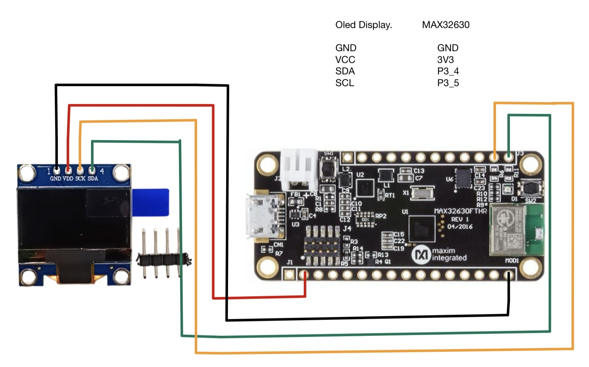
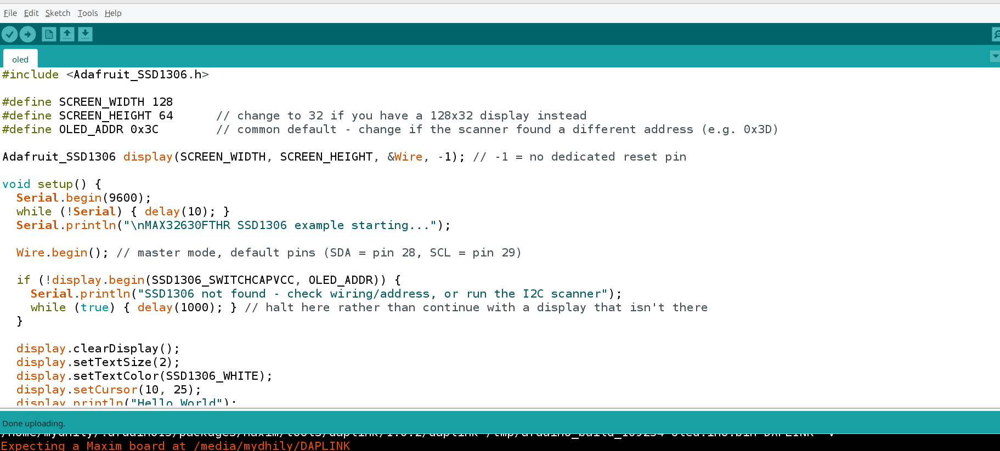
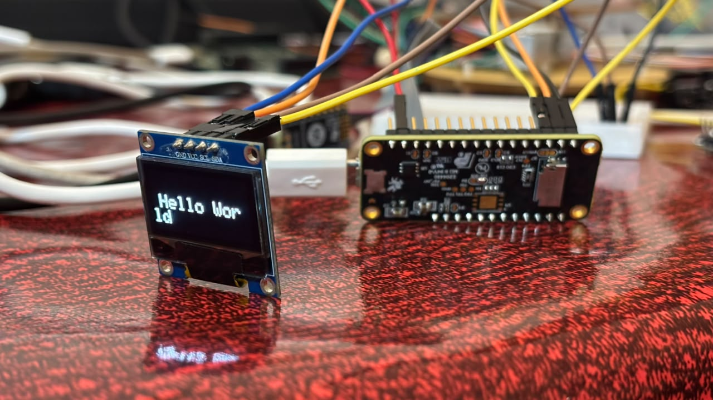

# Individual Sensor Testing

# OLED Display with MAX32630FTHR Board

### Goal

Interfacing SSD1306 Oled display with MAX32630fthr board.

### Final working setup

**Hardware:** MAX32630FTHR, NHX711 Weight sensor 5Kg

**Wiring** :
| Weight Sensor  | MAX32630FTHR |
|---|---|
| GND   | GND |
| VCC   | 3V3 |
| SDA    | P3_4 (pin 28 in software) |
| SCL    | P3_5 (pin 29 in software) |

  — OLED display Connection.

**Code Snippet:**
 — Oled display
## Output:

  — OLED output

