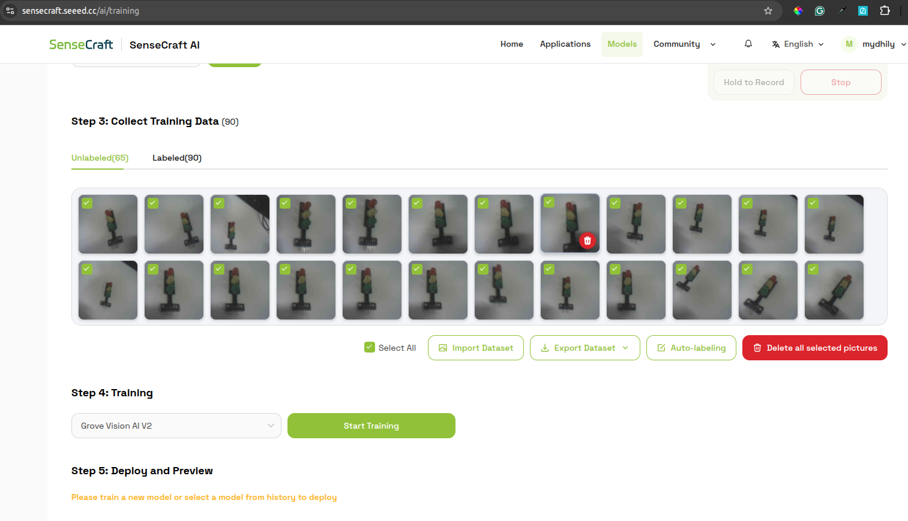
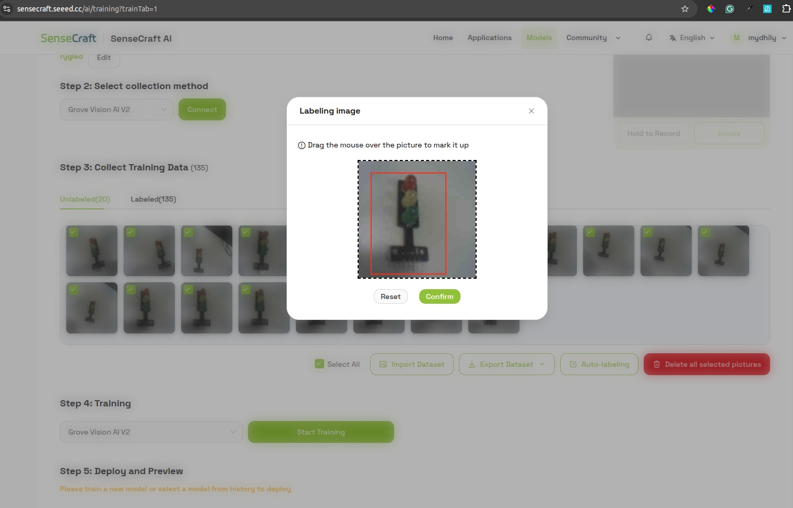
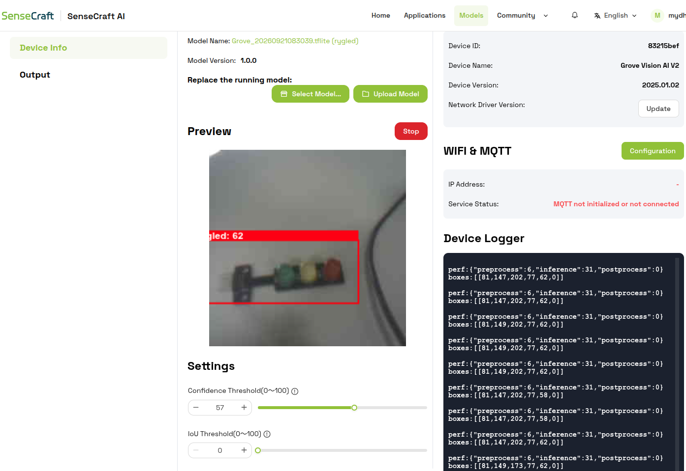
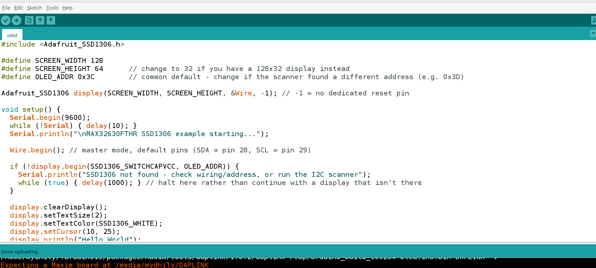
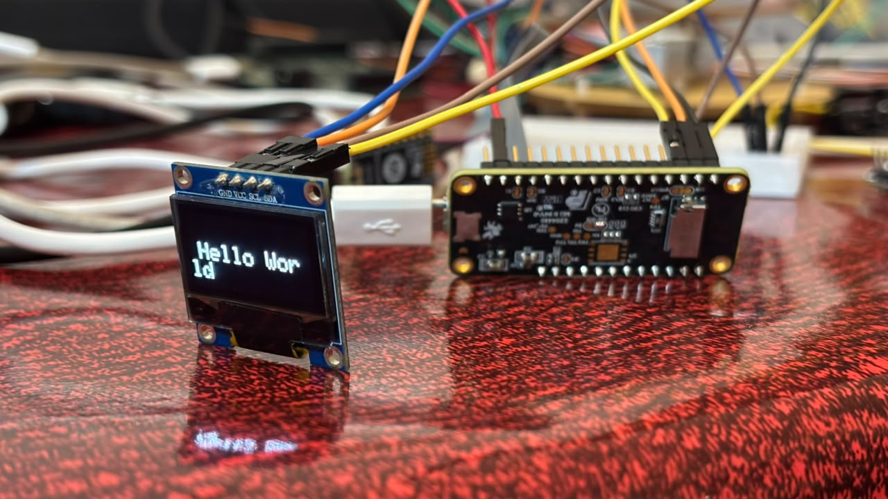

# Individual Sensor Testing

# HX711 Weight Sensor

### Goal

Interfacing Camera Module  with MAX32630fthr board.

### Final working setup

**Hardware:** MAX32630FTHR, Raspberry Pi Camera Module, Grove Vision AI Module v2

**Training:**
 — Oled display

 **Training:**
 — Oled display

 **Training:**
 — Oled display

**Wiring** :
| Weight Sensor  | MAX32630FTHR |
|---|---|
| GND   | GND |
| VCC   | 3V3 |
| SDA    | P3_4 (pin 28 in software) |
| SCL    | P3_5 (pin 29 in software) |

**Code Snippet:**
 — Oled display
## Output:

  — OLED output

### Coming Next...
- **I2C integration (Grove Vision AI Module V2)** was designed and discussed
  as a next step, but not yet implemented or tested — it would sit on a
  separate I2C bus from this UART link, with MAX32630FTHR as I2C master.
