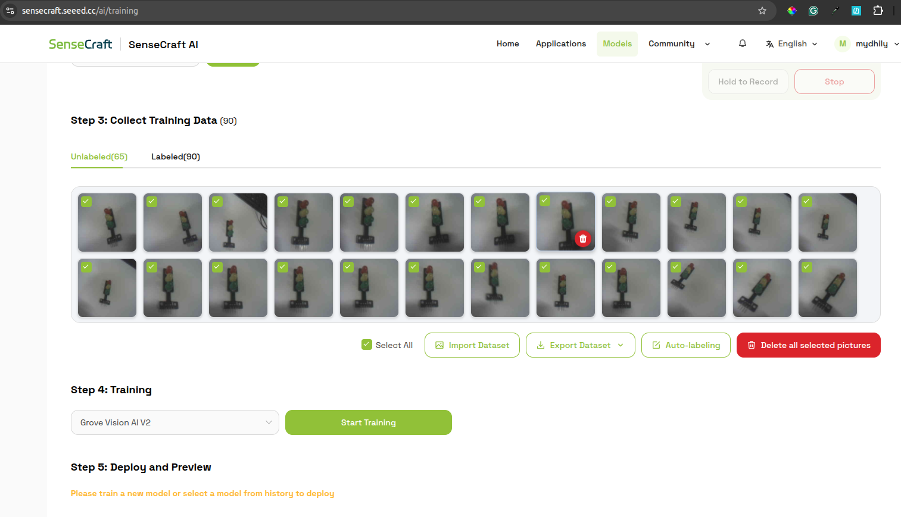
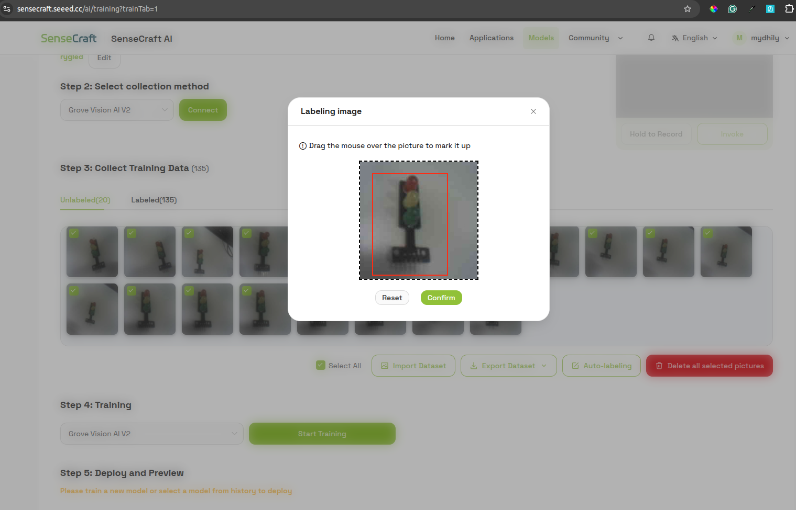
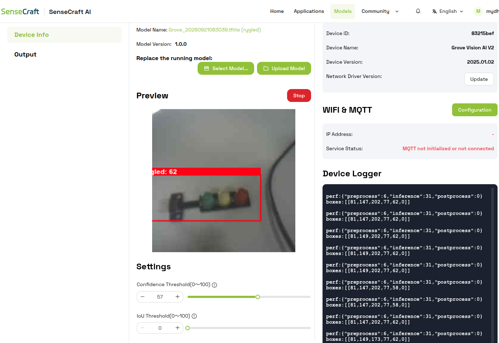

# Individual Sensor Testing

# Camera

### Goal

Interfacing Camera Module  with MAX32630fthr board.

### Final working setup

**Hardware:** MAX32630FTHR, Raspberry Pi Camera Module, Grove Vision AI Module v2

**Training:**
 — Camera Module

 **Training:**
 — Camera Module

 **Training:**
 — Camera Module
