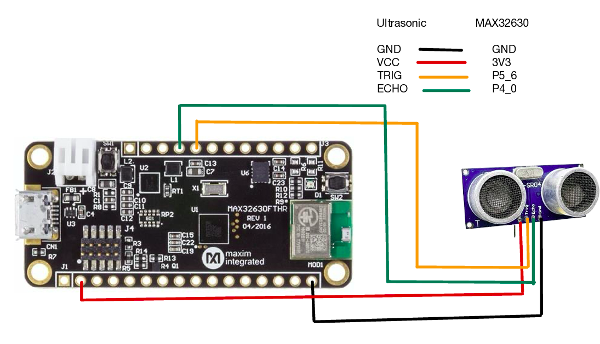

# Individual Sensor Testing

# HX711 Weight Sensor

### Goal

Interfacing SSD1306 Oled display with MAX32630fthr board.

### Final working setup

**Hardware:** MAX32630FTHR, NHX711 Weight sensor 5Kg

**Wiring** :
| Weight Sensor  | MAX32630FTHR |
|---|---|
| GND   | GND |
| VCC   | 3V3 |
| TRIG    | P5_6  |
| ECHO    | P4_0  |

  — Ultrasonic Connection.

**Code Snippet:**
 — Ultrasonic
## Output:
— Ultrasonic

