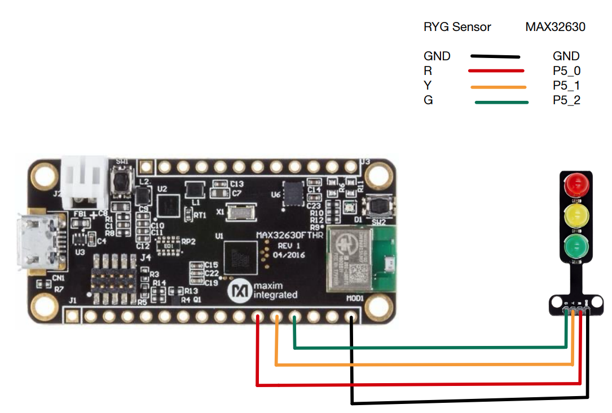
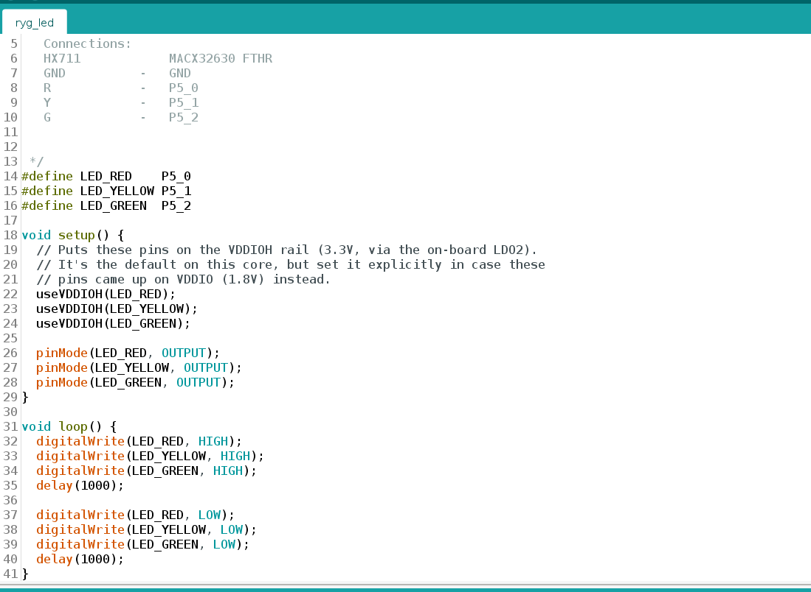
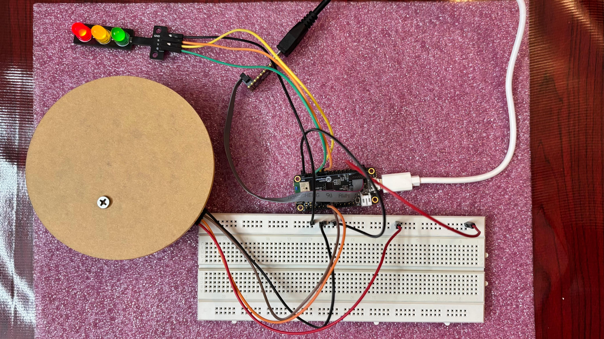

# Individual Sensor Testing

# RYG LED with MAX32630 FTHR

### Goal

Interfacing Camera Module  with MAX32630fthr board.

**Schematic:**
 — RYG

**Wiring** :
| RYG  | MAX32630FTHR |
|---|---|
| GND   | GND |
| R    | P5_0 |
| Y    | P5_1  |
| G    | P5_2  |

**Code Snippet:**
 — RYG

 ## Output

— RYG

