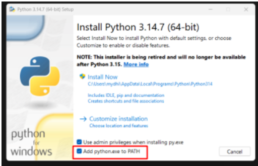
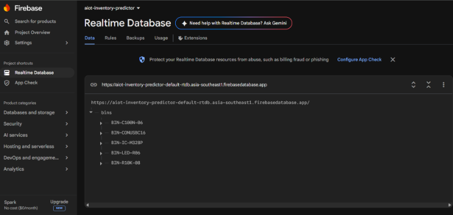
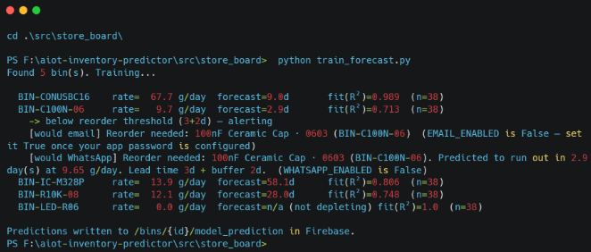
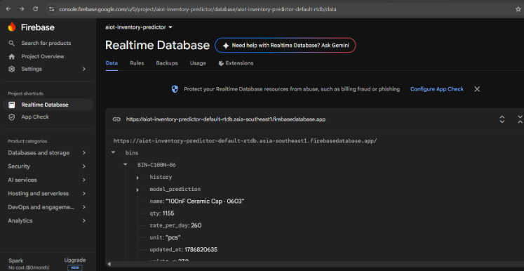
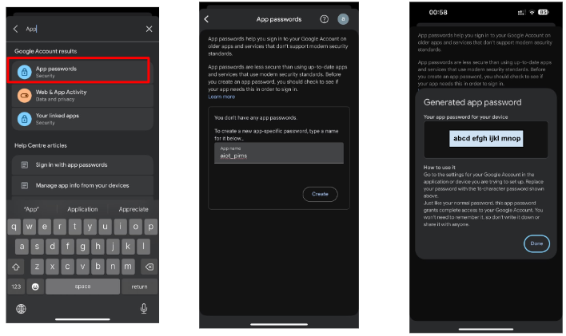

[← Back to README](../README.md)

## Day 2 - Installations and GUI
<!-- **15/08/2026** -->

Started a GitHub repo. GUI front end: HTML-based website.

## Required Softwares
- Python
- scikit-learn

### 1. Open Command Prompt and check Python

- Press the **Windows key**, type `cmd`, press **Enter** — a black window opens; this is where you'll type every command below.
- Type:
  ```bash
  python --version
  ```
  If you see something like `Python 3.12.x`, you're set — skip to the next step.
- If you see an error, go to [python.org](https://www.python.org), download Python, and during install tick **"Add python.exe to PATH"** before clicking **Install** — this is the single most common thing beginners miss.

 — Python installer screenshot with "Add python.exe to PATH" checkbox highlighted.

> <!-- 📷 **`image9`** — Terminal showing `python --version` → `Python 3.14.7`. -->

### 2. Install the required packages

- Still in Command Prompt (close and reopen it first if you just installed Python).
- Type:
  ```bash
  pip install requests pandas scikit-learn
  ```
- It'll download and install for a minute or two — wait until the prompt returns with no red error text.

> <!-- 📷 **`image10`** — Terminal output of `pip install requests pandas scikit-learn` completing successfully. -->

### 3. Create a project folder and save your files there

- Make a folder to keep everything together, e.g. right-click on your `C:` drive in File Explorer → **New Folder** → name it `store_board`.
- Add `simulate_gateway.py` and `train_forecast.py` into that folder.

### 4. Set up Firebase and get your database URL

- Skip this if you already did it earlier.
- Go to [console.firebase.google.com](https://console.firebase.google.com) → **create a project** → **Build** → **Realtime Database** → **Create Database** (test mode).
- Copy the `databaseURL` shown — it looks like:
  ```
  https://your-project-default-rtdb.firebaseio.com
  ```
- Example URL used in this project:
  ```
  https://aiot-inventory-predictor-default-rtdb.asia-southeast1.firebasedatabase.app/
  ```

   — Firebase console "Project Overview" welcome screen after project creation.

><!--- > 📷 **`image12`** — Firebase "Set up database" dialog, choosing the Realtime Database location (e.g. Singapore asia-southeast1). -->

><!--- 📷 **`image13`** — Firebase security rules step — choosing **Start in Test mode**. -->

><!--- 📷 **`image14`** — Firebase Realtime Database "Data" tab showing the empty database with its URL. -->

### 5. Paste your Firebase URL into both scripts

- Right-click `simulate_gateway.py` → **Open with** → **Notepad**.
- Find the line starting `FIREBASE_DB_URL` near the top, replace the placeholder text with your real URL (keep the quote marks), save (**Ctrl+S**), close.
- Do the exact same thing in `train_forecast.py`.

- Example URL: 
  ```c
  FIREBASE_DB_URL = "https://aiot-inventory-predictor-default-rtdb.asia-southeast1.firebasedatabase.app/"

  ```

> <!---📷 **`image15`** — Firebase console with the database URL highlighted, annotated with an arrow labeled "URL to paste in variable `FIREBASE_DB_URL`". -->

### 6. Run the simulator first — it creates the test data

- In Command Prompt, type:
  ```bash
  cd .\src\
  cd .\store_board\
  python simulate_gateway.py
  ```

Example output:
```
PS F:\aiot-inventory-predictor\src\store_board> python simulate_gateway.py
Simulated gateway starting — reporting every 30s. Ctrl+C to stop.

[00:09:05] Pushing readings...
  BIN-R10K-08      8399 pcs  (340.0g)  [ok]
  BIN-C100N-06     1199 pcs  (28.0g)   [ok]
  BIN-CONUSBC16     339 pcs  (612.0g)  [ok]
  BIN-IC-M328P      899 pcs  (810.0g)  [ok]
  BIN-LED-R06      5199 pcs  (31.0g)   [ok]
```

><!-- > 📷 **`image16`** — Terminal showing the simulator's first batch of pushed readings. -->

><!-- 📷 **`image17`** — Terminal showing a later batch of readings and the `Stopped.` message after Ctrl+C. -->

   — Firebase Realtime Database "Data" tab showing the `bins` node populated with entries like `BIN-C100N-06`, `BIN-CONUSBC16`, etc.

⚠️ Leave this window open and running — it pushes a new reading every 30 seconds and needs to run for **at least 5 minutes** before there's enough data to train on.

### 7. Open a second window and run the training script

- **Don't close the simulator's window.** Open a **new** Command Prompt window (same way as step 1), type `cd C:\store-board` again, then:
  ```bash
  python train_forecast.py
  ```
- This one runs once and exits — rerun it any time to refresh predictions with newer data.

 — Terminal output of `train_forecast.py`, showing per-bin rate/forecast/fit lines and reorder alert output.

### 8. What success looks like

Once `train_forecast.py` runs, you should see one line per bin, like:

```
BIN-R10K-08   rate=285.3 g/day  forecast=27.4d  fit(R²)=0.94  (n=12)
```

- If instead you see only 4 point(s) logged — need 10 — that just means the simulator hasn't been running long enough yet. Let it keep going a bit longer and rerun.
- At 30-second intervals, 10 minutes gives you about 20 readings per bin — double the minimum of 10 the training script needs.
- To stop the simulator: click into that Command Prompt window and press **Ctrl+C**. You'll see a `Stopped.` message, and the window is free to close.

### 9. Output Analysis

Reading each column:

| Column | Meaning |
|---|---|
| `rate` | The consumption speed the model learned from real data (grams/day) — not an assumption |
| `forecast` | Days until that bin hits zero, at the learned rate |
| `R²` | How confidently the model believes its own trend line, from 0 to 1. Closer to 1.0 = a clean, consistent depletion pattern. Lower = noisier, less certain |

> **`BIN-C100N-06` triggered the alert** — its forecast of 2.9 days is below its 3+2 = 5 day threshold, so the script correctly flagged it as needing a reorder. Right now it only printed what it *would have* sent, because email/WhatsApp are still switched off — that's expected, not a failure. This is the reorder logic working exactly as designed, end to end, on real data.

  — Firebase Realtime Database showing a bin's `model_prediction` node with fields like `name`, `qty`, `rate_per_day`, `unit`, `updated_at`.

### How to enable Email and WhatsApp

**Email:**

- By default `EMAIL_ENABLED = False`, so right now it just prints `[would email]` — safe to test with the simulator without spamming a real inbox.
- To actually turn emails on:
  1. On the Gmail account you'll send from: turn on **2-Step Verification**, then go to **Google Account → Security → App Passwords** and generate one (Gmail requires this — it won't accept your normal password).

  — Google Account "App passwords" settings screen. Generating a new app password, naming it (e.g. "aiot_pims").

  2. Paste that into `EMAIL_APP_PASSWORD`, fill in `EMAIL_FROM` / `EMAIL_TO`, set `EMAIL_ENABLED = True`.
  ```c
EMAIL_ENABLED = True
EMAIL_FROM = "aXXXXXXXXX@gmail.com"
EMAIL_APP_PASSWORD = "xxxx xxxx xxxx xxxx"   # not your normal password 
EMAIL_TO = "bXXXXXXX@gmail.com"
```

- Two things set as defaults that you should sanity-check once real data exists:
  - The **24-hour cooldown** between repeat alerts for the same bin — change `ALERT_COOLDOWN_HOURS` if you want it more/less frequent.

```c
ALERT_COOLDOWN_HOURS = 24
```

  - The **3+2 day default lead time** — that's a placeholder until you know each real component's actual reorder time.
  ```c
DEFAULT_REORDER_LEAD_DAYS = 3
DEFAULT_REORDER_BUFFER_DAYS = 2
```
- You can override this per bin by adding `reorder_lead_days` directly on that bin's node in Firebase.

**WhatsApp via CallMeBot — free, no signup, one HTTP call:**

- This is a well-known hobbyist service (confirmed still active) built for exactly this — sending yourself alerts from scripts, Arduino boards, home automation, etc.
- The catch: it's explicitly **personal-use only**, meaning it sends to your own WhatsApp number, not to arbitrary customers at scale.
- For this prototype — alerting the storekeeper (you, for the demo) — that's exactly the use case it's built for.

**Setup (do this once):**

1. Save `+34 644 33 66 63` to your phone contacts as anything you like (this is CallMeBot's official bot number — if it doesn't respond, check [callmebot.com](https://www.callmebot.com), they occasionally rotate to a backup number when the primary fills up).
2. From your own WhatsApp, message that contact:
   ```
   I allow callmebot to send me messages
   ```
3. Within a couple of minutes you'll get a reply containing your API key — save it, you'll need it in the script.


# Hardware setup
## Initial setup:

Reference Link: https://daplink.io/ 

#### Connections:
- Ribbon cable orientation — the cable has a colored stripe on one edge (marking pin 1). 

- It looks seated straight into both headers, but it's worth double-checking that the stripe lines up with the pin-1 marking (usually a small triangle, dot, or square pad) on both the PICO's connector and the target's header. 

- A cable seated backward or offset by one pin is a classic cause of exactly this "board not found" symptom, since the boards will still power up fine but SWD communication will fail.

- Give the MCU board its own power
The MAX32625PICO cannot supply power to every target board through the debug header alone. If your MCU is only powered through the PICO connection (rather than its own USB/power cable), connect a separate powered USB cable directly to the MCU board as well, so both boards are independently powered during programming.

### On Windows11 PC:
1. Download the firmware file.

2. While holding down the boards reset button, connect the boards USB debug port to the computer. It should enumerate and mount as ``` BOOTLOADER ``` or ``` MAINTENANCE ```. For boards that enumerate as ``` BOOTLOADER ``` see our blog to determine if an update for the DAPLink bootloader is available.

3. Drag-and-drop the firmware file onto the mounted drive.
Wait for the file copy operation to complete.

4. Power cycle the board - Disconnect the USB cable from the board to remove power, then reconnect it normally without holding any buttons.

5. It will now enumerate and mount as ``` DAPLIN ``` or the name of the board.

6. Windows has removed the wmic command, and the older Maxim daplink tool, so try the below method:


##### Export the compiled binary
In Arduino IDE, go to Sketch → Export Compiled Binary. This saves the .bin file into your sketch's own folder permanently, instead of a temp folder that gets wiped — open the sketch folder afterward (Sketch → Show Sketch Folder) and you'll see it there.

##### Open the DAPLINK drive
Open File Explorer and confirm the DAPLINK drive is mounted (it should show a drive letter next to the label DAPLINK, alongside DETAILS.TXT).

##### Copy the .bin file onto the DAPLINK drive
Simply drag the exported .bin file from your sketch folder and drop it onto the DAPLINK drive, just like copying a file to a USB stick. The drive will briefly disappear and remount as it flashes the firmware.

##### Check for success
If something went wrong, a FAIL.TXT file will appear on the drive explaining why. If it succeeds, the board will reset and your Blink sketch should start running — with Auto Reset enabled on your board, this happens automatically.

---
[← Back: Software Architecture & Code](software-architecture.md) · [← Back to README](../README.md)
