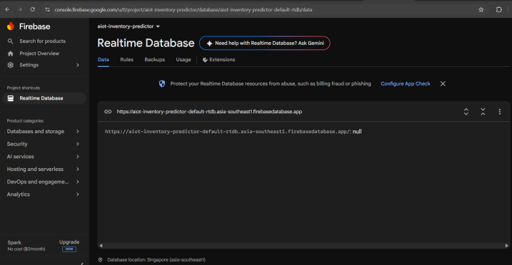
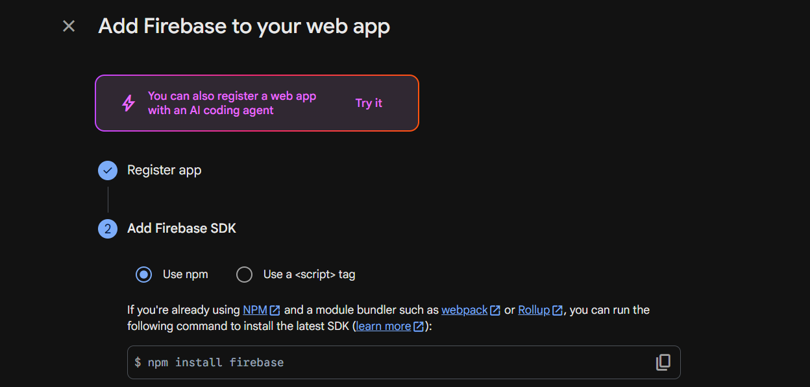
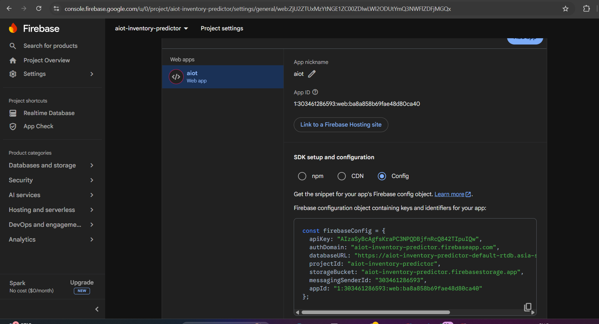
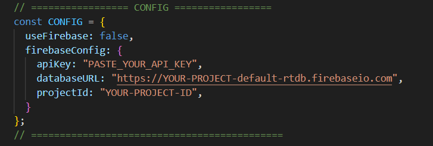
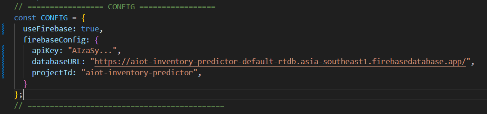
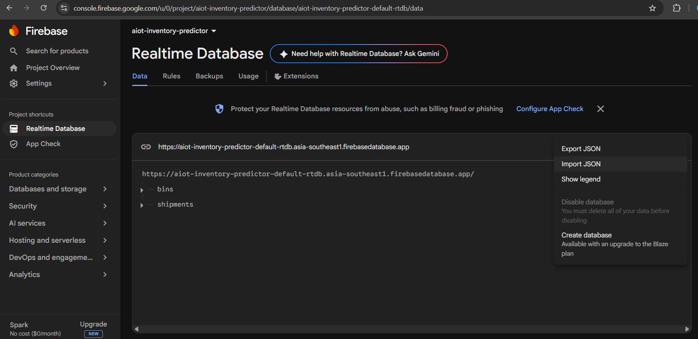

[← Back to README](../README.md)

## GUI set up
<!-- **15/08/2026** -->

## Required Softwares
- HTML
- CSS

###  Connecting GUI with Firebase for realtime Data

**1. Create the Firebase project & Realtime Database**

Sign in at console.firebase.google.com, create a new project, then go to Build > Realtime Database and click Create Database. Pick a region close to you and start in test mode — you'll lock it down later.
  

**2. Register a web app to get your config**

In Project settings (gear icon) > General, scroll to 'Your apps', click the </> web icon, and register an app (no nickname required, skip hosting). It will show you an apiKey, databaseURL, and projectId — copy all three.
  

Click the "Config" radio button (next to npm and CDN) — that swaps the panel to show a plain JavaScript object with your actual keys, which is what you need to paste into firebaseConfig.
  

**3. Paste the config into your file `<script>`**

Find the CONFIG object near the top of your  set `useFirebase` to true, and replace the three placeholder strings with the real values from step 2. That's the only code change needed.
  
 to

   

**4. Set your database rules**

Test-mode rules leave the database open to anyone with the URL, which is fine for a private prototype on your factory network. Plan to add Firebase Auth or scoped rules before this is reachable from outside.

**5. Load in your starting data**

Use the Data tab's Import JSON option (three-dot menu) to seed 'bins' and 'shipments' with data matching your existing demo arrays, so the dashboard looks identical on day one before live values start overwriting it.
   

**6. Point your gateway at the same paths (To Do)**

From your ESP32/ESP8266, send a plain HTTPS PUT to /bins/{binId}/qty.json whenever a new sensor reading comes in — no Firebase SDK needed on the device itself.

**7. Test the live link**

Reload the page. The sync dot should turn live once any data lands under /bins, and editing a value directly in the Firebase console should update your dashboard instantly.

---
[← Back: Set Up](day2-setup.md) · [← Back to Set Up](../day2-setup.md)

